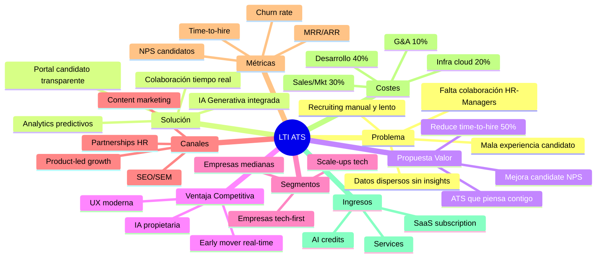
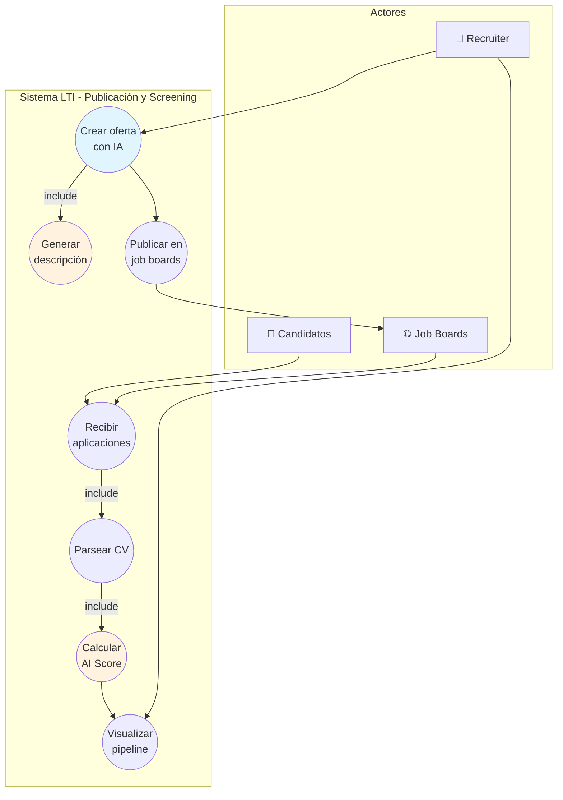
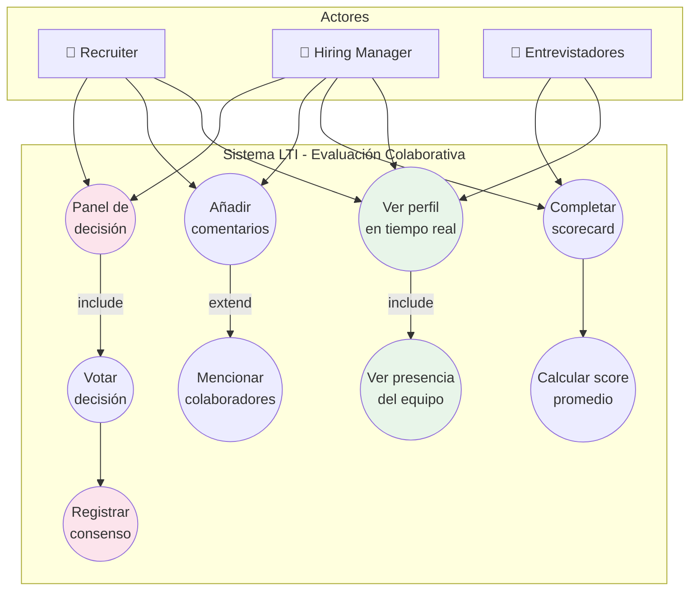
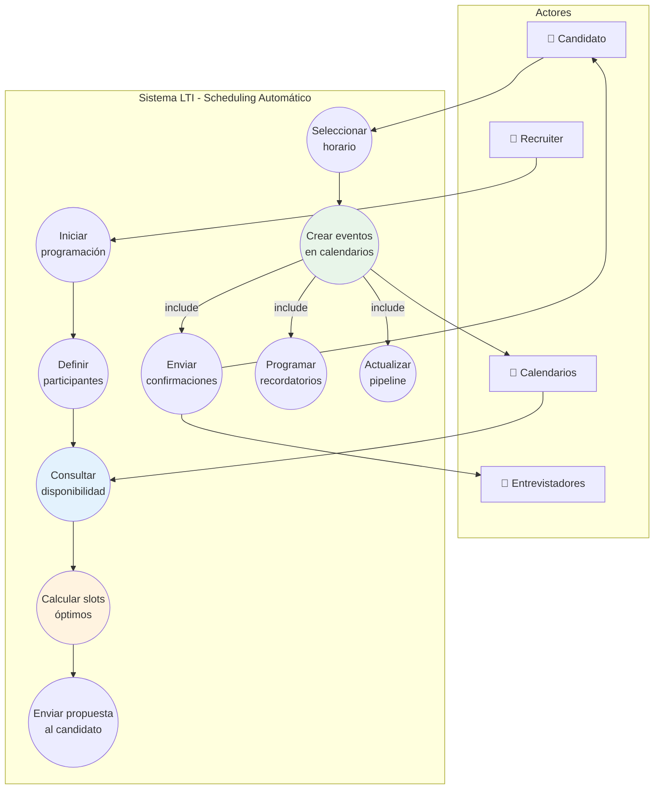
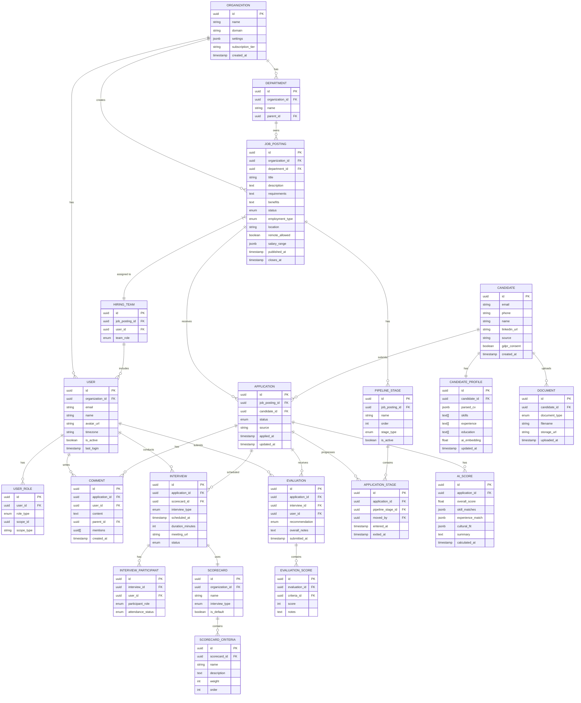
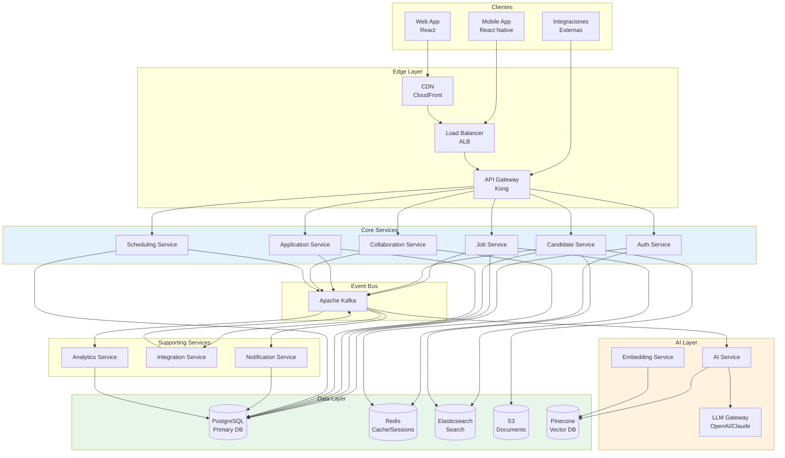
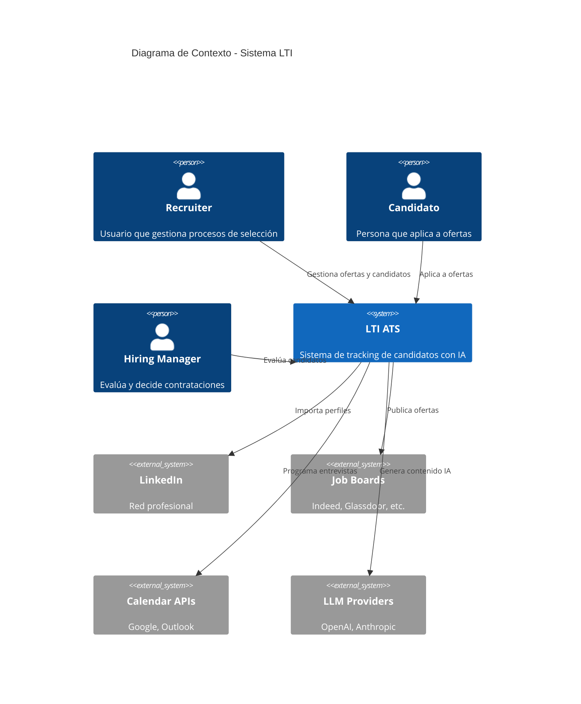
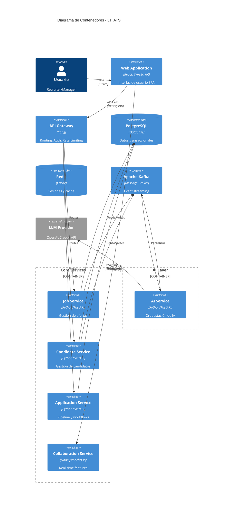
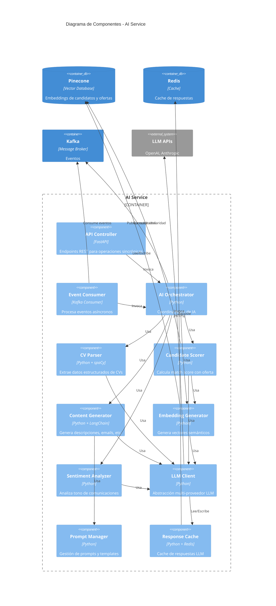
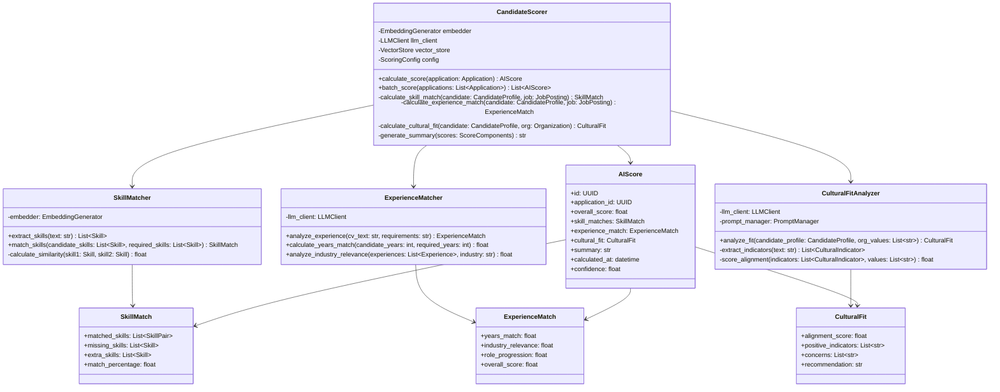

# LTI - Applicant Tracking System del Futuro

## 1. Descripción del Software

### 1.1 ¿Qué es LTI?

**LTI** (Leading Talent Intelligence) es un sistema de seguimiento de candidatos (ATS) de nueva generación diseñado para transformar radicalmente la forma en que las empresas atraen, evalúan y contratan talento. A diferencia de los ATS tradicionales que funcionan como simples bases de datos de CVs, LTI actúa como un **copiloto inteligente** para todo el equipo de contratación.

### 1.2 Valor Añadido

| Aspecto | ATS Tradicional | LTI |
|---------|-----------------|-----|
| **Screening de CVs** | Manual o keywords básicos | IA que entiende contexto y potencial |
| **Colaboración** | Comentarios asíncronos | Tiempo real tipo Figma |
| **Comunicación** | Emails genéricos | Personalizada y automatizada con IA |
| **Analytics** | Reportes estáticos | Insights predictivos y prescriptivos |
| **Experiencia candidato** | Portal básico | App moderna con transparencia total |

### 1.3 Ventajas Competitivas

1. **IA Generativa Nativa**: No es un add-on, está integrada en el core del producto.
   - Generación automática de descripciones de puesto
   - Resúmenes inteligentes de candidatos
   - Sugerencias de preguntas de entrevista personalizadas
   - Análisis de fit cultural basado en valores de empresa

2. **Colaboración en Tiempo Real**: Inspirado en herramientas modernas como Figma y Notion.
   - Múltiples usuarios editando simultáneamente
   - Cursores en vivo y presencia de equipo
   - Decisiones de contratación sincronizadas

3. **Automatización Inteligente**: Workflows que aprenden y se adaptan.
   - Triggers basados en comportamiento
   - Escalado automático de urgencias
   - Re-engagement de candidatos pasivos

4. **Candidate Experience Premium**: El candidato como cliente.
   - Portal transparente con estado en tiempo real
   - Feedback constructivo automatizado
   - Scheduling inteligente sin fricciones

5. **Integraciones sin Código**: Conecta con tu stack existente en minutos.
   - 200+ conectores pre-construidos
   - API abierta y webhooks
   - Marketplace de extensiones

---

## 2. Funciones Principales

### 2.1 Gestión de Ofertas de Empleo

- **Creación asistida por IA**: Genera descripciones optimizadas para SEO y diversidad
- **Multi-posting automático**: Publica en 50+ job boards con un clic
- **Landing pages personalizadas**: Cada oferta con su micrositio de marca
- **A/B testing de ofertas**: Optimiza títulos y descripciones

### 2.2 Pipeline de Candidatos

- **Kanban visual**: Arrastra y suelta candidatos entre etapas
- **Vistas personalizables**: Lista, tabla, calendario, timeline
- **Filtros avanzados**: Por skills, experiencia, scoring, ubicación
- **Bulk actions**: Acciones masivas con confirmación inteligente

### 2.3 Screening Inteligente

- **AI Scoring**: Puntuación 0-100 basada en fit con el puesto
- **Parsing avanzado**: Extrae datos estructurados de cualquier formato
- **Detección de duplicados**: Identifica candidatos que ya aplicaron
- **Análisis de red flags**: Alertas sobre inconsistencias

### 2.4 Evaluación y Entrevistas

- **Scorecards estructuradas**: Plantillas personalizables por rol
- **Scheduling automático**: Integración con calendarios y zonas horarias
- **Video interviews**: Plataforma integrada o conexión con Zoom/Teams
- **Evaluaciones técnicas**: Integración con plataformas de coding tests

### 2.5 Colaboración en Tiempo Real

- **Comentarios contextuales**: En cualquier parte del perfil
- **@menciones y notificaciones**: Mantén al equipo informado
- **Panel de decisión**: Votación y consenso estructurado
- **Activity feed**: Historial completo de interacciones

### 2.6 Comunicación con Candidatos

- **Email templates con IA**: Personalización automática
- **Secuencias automatizadas**: Nurturing de candidatos
- **WhatsApp/SMS integration**: Comunicación omnicanal
- **Chatbot para FAQs**: Responde preguntas frecuentes 24/7

### 2.7 Analytics y Reporting

- **Dashboard en tiempo real**: KPIs de recruiting
- **Funnel analysis**: Identifica cuellos de botella
- **Time-to-hire tracking**: Por departamento, rol, recruiter
- **DEI metrics**: Diversidad en cada etapa del pipeline
- **Predictive analytics**: Proyecciones de contratación

### 2.8 Administración y Compliance

- **Gestión de permisos granular**: Por equipo, departamento, ubicación
- **Audit trail completo**: Cumplimiento GDPR/CCPA
- **Data retention policies**: Configurables por jurisdicción
- **SSO y 2FA**: Seguridad enterprise

---

## 3. Lean Canvas

```
┌─────────────────┬─────────────────┬─────────────────┬─────────────────┬─────────────────┐
│    PROBLEMA     │    SOLUCIÓN     │ PROPUESTA VALOR │VENTAJA ESPECIAL │    SEGMENTOS    │
│                 │                 │     ÚNICA       │                 │    CLIENTES     │
│ 1. Procesos de  │ 1. IA generativa│                 │                 │                 │
│    recruiting   │    para auto-   │ "El único ATS   │ Tecnología IA   │ 1. Empresas     │
│    manuales y   │    matizar      │  que piensa     │ propietaria de  │    medianas     │
│    lentos       │    screening    │  contigo, no    │ matching y      │    (50-500 emp) │
│                 │                 │  solo almacena  │ scoring de      │                 │
│ 2. Falta de     │ 2. Colaboración │  datos"         │ candidatos      │ 2. Scale-ups    │
│    colaboración │    tiempo real  │                 │                 │    en           │
│    entre HR y   │    estilo Figma │                 │ Early mover en  │    crecimiento  │
│    hiring       │                 │                 │ colaboración    │                 │
│    managers     │ 3. Portal de    │                 │ real-time para  │ 3. Empresas     │
│                 │    candidato    │                 │ ATS             │    tech-first   │
│ 3. Mala         │    transparente │                 │                 │                 │
│    experiencia  │                 │                 │                 │                 │
│    del          │                 │                 │                 │                 │
│    candidato    │                 │                 │                 │                 │
├─────────────────┼─────────────────┴─────────────────┴─────────────────┼─────────────────┤
│                 │                                                     │                 │
│  MÉTRICAS       │                    CANALES                          │  ESTRUCTURA     │
│  CLAVE          │                                                     │  DE COSTES      │
│                 │  1. Marketing de contenido (blog, webinars)         │                 │
│ - MRR/ARR       │  2. SEO/SEM para "ATS software"                     │ - Desarrollo    │
│ - Time-to-hire  │  3. Partnerships con consultoras HR                 │   producto 40%  │
│   de clientes   │  4. Product-led growth (trial gratuito)             │ - Infra cloud   │
│ - NPS de        │  5. Eventos HR Tech                                 │   20%           │
│   candidatos    │                                                     │ - Sales &       │
│ - Churn rate    │                                                     │   Marketing 30% │
│ - Usuarios      │                                                     │ - G&A 10%       │
│   activos       ├─────────────────────────────────────────────────────┤                 │
│                 │                                                     │                 │
│                 │               FUENTES DE INGRESOS                   │                 │
│                 │                                                     │                 │
│                 │  1. SaaS subscription (por usuario/mes)             │                 │
│                 │     - Starter: $49/user/mes                         │                 │
│                 │     - Professional: $99/user/mes                    │                 │
│                 │     - Enterprise: Custom                            │                 │
│                 │  2. Add-ons: AI credits, integraciones premium      │                 │
│                 │  3. Services: Implementación, training              │                 │
│                 │                                                     │                 │
└─────────────────┴─────────────────────────────────────────────────────┴─────────────────┘
```

### Diagrama Lean Canvas (Mermaid)



---

## 4. Casos de Uso Principales

### 4.1 Caso de Uso 1: Publicación y Screening de Ofertas con IA

**Descripción**: Un recruiter necesita crear una nueva oferta de empleo, publicarla en múltiples plataformas y realizar el screening inicial de los candidatos que apliquen, todo con asistencia de IA.

**Actores**:
- Recruiter (primario)
- Sistema de IA
- Job Boards externos
- Candidatos

**Precondiciones**:
- El recruiter está autenticado en el sistema
- Existe al menos un hiring manager asignado al departamento

**Flujo Principal**:
1. El recruiter accede al módulo de ofertas
2. Selecciona "Crear nueva oferta con IA"
3. Ingresa título del puesto y requisitos básicos
4. La IA genera descripción completa, requisitos y beneficios
5. El recruiter revisa y ajusta el contenido
6. Selecciona job boards para publicación
7. El sistema publica automáticamente en todas las plataformas
8. Los candidatos aplican a través de los diferentes canales
9. El sistema parsea CVs y extrae información estructurada
10. La IA calcula score de match para cada candidato
11. El recruiter visualiza candidatos ordenados por score
12. Selecciona candidatos para siguiente fase

**Postcondiciones**:
- Oferta publicada en múltiples plataformas
- Candidatos con scoring automático
- Pipeline inicial creado

**Diagrama de Caso de Uso**:



---

### 4.2 Caso de Uso 2: Evaluación Colaborativa de Candidatos

**Descripción**: El equipo de contratación (recruiter, hiring manager, entrevistadores) evalúa colaborativamente a un candidato, compartiendo feedback en tiempo real y llegando a una decisión de consenso.

**Actores**:
- Recruiter
- Hiring Manager
- Entrevistadores
- Candidato (indirecto)

**Precondiciones**:
- Candidato ha pasado el screening inicial
- Entrevistas programadas y completadas
- Scorecards disponibles para el rol

**Flujo Principal**:
1. El hiring manager accede al perfil del candidato
2. Ve en tiempo real quién más está viendo el perfil (presencia)
3. Completa su scorecard de evaluación
4. Añade comentarios contextuales sobre respuestas específicas
5. @menciona al recruiter para discutir un punto
6. El recruiter responde en tiempo real
7. Los entrevistadores completan sus scorecards
8. El sistema calcula score promedio y muestra comparativa
9. Se abre panel de decisión colaborativa
10. Cada participante vota: Contratar / No contratar / Necesita más info
11. Se alcanza consenso
12. El sistema registra la decisión y notifica siguiente paso

**Postcondiciones**:
- Candidato con decisión registrada
- Historial completo de evaluación
- Próximos pasos activados

**Diagrama de Caso de Uso**:



---

### 4.3 Caso de Uso 3: Programación Automática de Entrevistas

**Descripción**: El sistema coordina automáticamente la programación de entrevistas entre múltiples participantes, considerando disponibilidad, zonas horarias y preferencias, minimizando el trabajo manual del recruiter.

**Actores**:
- Recruiter
- Candidato
- Entrevistadores
- Sistema de Calendario (Google/Outlook)

**Precondiciones**:
- Candidato aprobado para entrevista
- Entrevistadores definidos para el proceso
- Calendarios conectados al sistema

**Flujo Principal**:
1. El recruiter selecciona candidato para entrevistar
2. Define tipo de entrevista y participantes requeridos
3. El sistema consulta disponibilidad de todos los calendarios
4. Calcula slots óptimos considerando zonas horarias
5. Presenta opciones al recruiter
6. El recruiter aprueba envío de propuestas al candidato
7. El candidato recibe link para seleccionar horario preferido
8. El candidato elige slot disponible
9. El sistema crea evento en todos los calendarios
10. Envía confirmaciones con links de videoconferencia
11. Crea recordatorios automáticos (24h, 1h antes)
12. Actualiza el estado del candidato en el pipeline

**Flujos Alternativos**:
- **4a**: No hay slots comunes → Sistema sugiere entrevistas parciales
- **8a**: Candidato no responde en 48h → Reminder automático
- **8b**: Candidato solicita otras fechas → Recruiter recibe notificación

**Postcondiciones**:
- Entrevista programada en todos los calendarios
- Candidato y entrevistadores notificados
- Pipeline actualizado

**Diagrama de Caso de Uso**:



---

## 5. Modelo de Datos

### 5.1 Diagrama Entidad-Relación



### 5.2 Descripción de Entidades Principales

#### ORGANIZATION
Representa una empresa cliente de LTI.

| Atributo | Tipo | Descripción |
|----------|------|-------------|
| id | UUID | Identificador único |
| name | VARCHAR(255) | Nombre de la organización |
| domain | VARCHAR(255) | Dominio de email corporativo |
| settings | JSONB | Configuraciones personalizadas |
| subscription_tier | VARCHAR(50) | Nivel de suscripción |
| created_at | TIMESTAMP | Fecha de registro |

#### USER
Usuarios del sistema (recruiters, hiring managers, etc.).

| Atributo | Tipo | Descripción |
|----------|------|-------------|
| id | UUID | Identificador único |
| organization_id | UUID | FK a organization |
| email | VARCHAR(255) | Email único |
| name | VARCHAR(255) | Nombre completo |
| avatar_url | VARCHAR(500) | URL de foto de perfil |
| timezone | VARCHAR(50) | Zona horaria preferida |
| is_active | BOOLEAN | Estado de la cuenta |
| last_login | TIMESTAMP | Último acceso |

#### JOB_POSTING
Ofertas de empleo publicadas.

| Atributo | Tipo | Descripción |
|----------|------|-------------|
| id | UUID | Identificador único |
| organization_id | UUID | FK a organization |
| department_id | UUID | FK a department |
| title | VARCHAR(255) | Título del puesto |
| description | TEXT | Descripción generada/editada |
| requirements | TEXT | Requisitos del puesto |
| benefits | TEXT | Beneficios ofrecidos |
| status | ENUM | draft, published, closed, archived |
| employment_type | ENUM | full_time, part_time, contract, internship |
| location | VARCHAR(255) | Ubicación del puesto |
| remote_allowed | BOOLEAN | Permite trabajo remoto |
| salary_range | JSONB | {min, max, currency, period} |
| published_at | TIMESTAMP | Fecha de publicación |
| closes_at | TIMESTAMP | Fecha límite |

#### CANDIDATE
Personas que aplican a ofertas.

| Atributo | Tipo | Descripción |
|----------|------|-------------|
| id | UUID | Identificador único |
| email | VARCHAR(255) | Email de contacto |
| phone | VARCHAR(50) | Teléfono |
| name | VARCHAR(255) | Nombre completo |
| linkedin_url | VARCHAR(500) | Perfil de LinkedIn |
| source | VARCHAR(100) | Origen del candidato |
| gdpr_consent | BOOLEAN | Consentimiento GDPR |
| created_at | TIMESTAMP | Primera aplicación |

#### APPLICATION
Aplicación de un candidato a una oferta específica.

| Atributo | Tipo | Descripción |
|----------|------|-------------|
| id | UUID | Identificador único |
| job_posting_id | UUID | FK a job_posting |
| candidate_id | UUID | FK a candidate |
| status | ENUM | active, hired, rejected, withdrawn |
| source | VARCHAR(100) | Canal de aplicación |
| applied_at | TIMESTAMP | Fecha de aplicación |
| updated_at | TIMESTAMP | Última actualización |

#### AI_SCORE
Puntuación calculada por IA para matching.

| Atributo | Tipo | Descripción |
|----------|------|-------------|
| id | UUID | Identificador único |
| application_id | UUID | FK a application |
| overall_score | FLOAT | Score general 0-100 |
| skill_matches | JSONB | Detalle de match por skill |
| experience_match | JSONB | Análisis de experiencia |
| cultural_fit | JSONB | Indicadores de fit cultural |
| summary | TEXT | Resumen generado por IA |
| calculated_at | TIMESTAMP | Fecha de cálculo |

#### INTERVIEW
Entrevistas programadas.

| Atributo | Tipo | Descripción |
|----------|------|-------------|
| id | UUID | Identificador único |
| application_id | UUID | FK a application |
| scorecard_id | UUID | FK a scorecard |
| interview_type | ENUM | phone, video, onsite, technical |
| scheduled_at | TIMESTAMP | Fecha/hora programada |
| duration_minutes | INT | Duración planificada |
| meeting_url | VARCHAR(500) | URL de videoconferencia |
| status | ENUM | scheduled, completed, cancelled, no_show |

#### EVALUATION
Evaluación de un entrevistador sobre un candidato.

| Atributo | Tipo | Descripción |
|----------|------|-------------|
| id | UUID | Identificador único |
| application_id | UUID | FK a application |
| interview_id | UUID | FK a interview (opcional) |
| user_id | UUID | FK a user (evaluador) |
| recommendation | ENUM | strong_hire, hire, no_hire, strong_no_hire |
| overall_notes | TEXT | Notas generales |
| submitted_at | TIMESTAMP | Fecha de envío |

---

## 6. Diseño de Alto Nivel

### 6.1 Descripción de la Arquitectura

LTI utiliza una **arquitectura de microservicios** con los siguientes principios:

1. **Event-Driven**: Los servicios se comunican principalmente mediante eventos asíncronos, lo que permite:
   - Colaboración en tiempo real
   - Desacoplamiento entre servicios
   - Escalabilidad independiente

2. **API-First**: Cada servicio expone una API REST documentada, y existe un API Gateway central.

3. **CQRS para lectura intensiva**: Separación de modelos de lectura y escritura donde el rendimiento lo requiere.

4. **Multi-tenant**: Datos aislados por organización con posibilidad de instancias dedicadas para enterprise.

### 6.2 Componentes Principales

| Componente | Responsabilidad | Tecnología |
|------------|-----------------|------------|
| **API Gateway** | Routing, auth, rate limiting | Kong / AWS API Gateway |
| **Auth Service** | Autenticación, SSO, tokens | Node.js + Passport |
| **Job Service** | CRUD de ofertas, publicación | Python + FastAPI |
| **Candidate Service** | Gestión de candidatos y CVs | Python + FastAPI |
| **Application Service** | Pipeline, estados, workflows | Python + FastAPI |
| **AI Service** | Scoring, generación, parsing | Python + LangChain |
| **Collaboration Service** | Real-time, presencia, comments | Node.js + Socket.io |
| **Notification Service** | Emails, push, webhooks | Node.js + Bull |
| **Scheduling Service** | Calendarios, entrevistas | Node.js + Temporal |
| **Analytics Service** | Métricas, reportes | Python + Apache Spark |
| **Integration Service** | Conectores externos | Node.js + n8n |

### 6.3 Diagrama de Arquitectura



### 6.4 Flujo de Datos Principal

1. **Request Flow**:
   - Cliente → CDN → Load Balancer → API Gateway → Servicio
   - API Gateway valida JWT con Auth Service
   - Servicio procesa request y persiste en PostgreSQL

2. **Event Flow**:
   - Servicio publica evento en Kafka
   - Servicios subscriptores reaccionan (ej: AI procesa nuevo CV)
   - Collaboration Service emite via WebSocket a clientes conectados

3. **AI Flow**:
   - Candidate Service publica evento `cv.uploaded`
   - AI Service consume evento, procesa con LLM
   - Genera embeddings y almacena en Vector DB
   - Publica evento `score.calculated`
   - Application Service actualiza score del candidato

---

## 7. Diagrama C4 - AI Service

Se presenta el diagrama C4 del **AI Service**, componente crítico para la diferenciación de LTI.

### 7.1 Nivel 1: Contexto del Sistema



### 7.2 Nivel 2: Contenedores



### 7.3 Nivel 3: Componentes del AI Service



### 7.4 Nivel 4: Código del Componente Scorer



### 7.5 Descripción de Componentes del AI Service

| Componente | Responsabilidad | Tecnología |
|------------|-----------------|------------|
| **API Controller** | Expone endpoints REST para scoring bajo demanda, generación de contenido | FastAPI |
| **Event Consumer** | Consume eventos de Kafka (cv.uploaded, job.created) para procesamiento async | aiokafka |
| **AI Orchestrator** | Coordina el flujo entre componentes según el tipo de operación | Python async |
| **CV Parser** | Extrae datos estructurados (skills, experiencia, educación) de CVs | spaCy + LLM |
| **Candidate Scorer** | Calcula score de match entre candidato y oferta | Python + embeddings |
| **Content Generator** | Genera descripciones de puesto, emails, feedback | LangChain |
| **Embedding Generator** | Crea representaciones vectoriales de textos | OpenAI embeddings |
| **Sentiment Analyzer** | Analiza tono de comunicaciones candidato-empresa | LLM |
| **LLM Client** | Abstracción para múltiples proveedores (OpenAI, Claude) | Python |
| **Prompt Manager** | Gestiona templates de prompts versionados | Python + YAML |
| **Response Cache** | Cachea respuestas LLM para reducir costos y latencia | Redis |

---

## 8. Consideraciones Técnicas Adicionales

### 8.1 Seguridad

- **Autenticación**: OAuth 2.0 + OpenID Connect, soporte SSO (SAML)
- **Autorización**: RBAC con permisos granulares por recurso
- **Datos en tránsito**: TLS 1.3 obligatorio
- **Datos en reposo**: AES-256 para datos sensibles
- **Compliance**: GDPR, CCPA, SOC 2 Type II

### 8.2 Escalabilidad

- **Horizontal**: Kubernetes con HPA basado en métricas
- **Base de datos**: Read replicas para consultas, sharding por org para enterprise
- **Cache**: Redis Cluster para sesiones y datos calientes
- **CDN**: Assets estáticos y APIs cacheables

### 8.3 Observabilidad

- **Logs**: ELK Stack centralizado
- **Métricas**: Prometheus + Grafana
- **Tracing**: Jaeger para distributed tracing
- **Alerting**: PagerDuty integrado

### 8.4 Disaster Recovery

- **RTO**: 4 horas
- **RPO**: 1 hora
- **Backups**: Continuos a S3 cross-region
- **Multi-AZ**: Todos los servicios críticos

---

## 9. Roadmap de Desarrollo

### MVP (v1.0) - Funcionalidad Core
- Gestión de ofertas y candidatos
- Pipeline Kanban básico
- AI Scoring inicial
- Integraciones email básicas

### v1.5 - Colaboración
- Real-time collaboration
- Comentarios y menciones
- Panel de decisión

### v2.0 - AI Avanzada
- Generación de contenido completa
- Matching semántico avanzado
- Chatbot para candidatos

### v2.5 - Enterprise
- SSO/SCIM
- Multi-idioma
- Customización avanzada
- API pública completa
