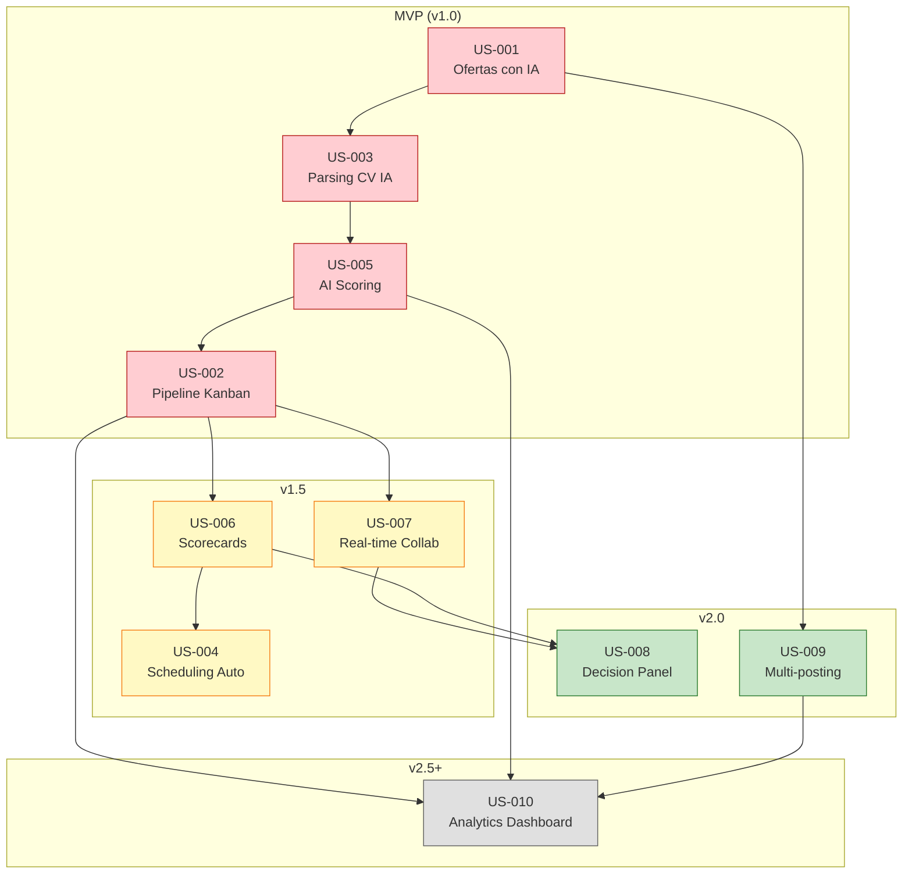

# Product Backlog - LTI ATS

## Metodología de Priorización: MoSCoW + Value vs Effort Matrix

Para priorizar el backlog del producto LTI, se utilizó una combinación de dos metodologías:

### 1. MoSCoW Method
Clasificación de cada User Story según su criticidad para el MVP y versiones posteriores:
- **Must Have**: Funcionalidades esenciales sin las cuales el producto no es viable
- **Should Have**: Importantes, pero el producto puede lanzarse sin ellas
- **Could Have**: Deseables si hay tiempo y recursos
- **Won't Have (this time)**: Fuera de scope para esta versión

### 2. Value vs Effort Matrix (WSJF - Weighted Shortest Job First)
Para las historias Must y Should, se aplicó un análisis de:
- **Business Value** (1-10): Impacto en el negocio y diferenciación
- **User Value** (1-10): Beneficio directo para el usuario
- **Risk Reduction** (1-10): Reduce riesgo técnico o de negocio
- **Effort** (puntos de historia de Fibonacci)

**WSJF Score = (Business Value + User Value + Risk Reduction) / Effort**

---

## Clasificación MoSCoW

### 🔴 Must Have (MVP - v1.0)
| ID | User Story | Business Value | User Value | Risk Reduction | Effort | WSJF Score |
|----|------------|----------------|------------|----------------|--------|------------|
| US-003 | Aplicación y Parsing de CV con IA | 10 | 10 | 8 | 13 | 2.15 |
| US-005 | Scoring Automático de Candidatos | 10 | 9 | 9 | 21 | 1.33 |
| US-002 | Pipeline Kanban de Candidatos | 8 | 10 | 6 | 8 | 3.00 |
| US-001 | Creación de Ofertas con IA | 9 | 8 | 7 | 13 | 1.85 |

### 🟡 Should Have (v1.5)
| ID | User Story | Business Value | User Value | Risk Reduction | Effort | WSJF Score |
|----|------------|----------------|------------|----------------|--------|------------|
| US-004 | Programación Automática de Entrevistas | 8 | 9 | 5 | 21 | 1.05 |
| US-006 | Evaluación con Scorecards | 7 | 8 | 6 | 13 | 1.62 |
| US-007 | Colaboración en Tiempo Real | 9 | 8 | 7 | 21 | 1.14 |

### 🟢 Could Have (v2.0)
| ID | User Story | Business Value | User Value | Risk Reduction | Effort | WSJF Score |
|----|------------|----------------|------------|----------------|--------|------------|
| US-008 | Panel de Decisión Colaborativa | 7 | 7 | 4 | 13 | 1.38 |
| US-009 | Multi-posting en Job Boards | 8 | 7 | 3 | 21 | 0.86 |

### ⚪ Won't Have (this release)
| ID | User Story | Razón |
|----|------------|-------|
| US-010 | Dashboard de Analytics | Requiere datos históricos; mejor para v2.5+ |

---

## Backlog Priorizado Final

Ordenado por prioridad de implementación (considerando dependencias técnicas y WSJF):

### Sprint 1-2: Foundation
| Orden | ID | User Story | Estimación | Justificación |
|-------|----|-----------|-----------:|---------------|
| 1 | US-002 | Pipeline Kanban de Candidatos | 8 pts | WSJF más alto (3.00), base visual del sistema, baja complejidad |
| 2 | US-001 | Creación de Ofertas con IA | 13 pts | WSJF 1.85, necesario para tener candidatos, muestra diferenciación IA |

### Sprint 3-4: AI Core
| Orden | ID | User Story | Estimación | Justificación |
|-------|----|-----------|-----------:|---------------|
| 3 | US-003 | Aplicación y Parsing de CV con IA | 13 pts | WSJF 2.15, habilita todo el flujo de candidatos |
| 4 | US-005 | Scoring Automático de Candidatos | 21 pts | Core value proposition, depende de US-003 |

### Sprint 5-6: Productivity
| Orden | ID | User Story | Estimación | Justificación |
|-------|----|-----------|-----------:|---------------|
| 5 | US-006 | Evaluación con Scorecards | 13 pts | Habilita proceso de entrevistas estructurado |
| 6 | US-004 | Programación Automática de Entrevistas | 21 pts | Automatización clave, depende de US-006 |

### Sprint 7-8: Collaboration
| Orden | ID | User Story | Estimación | Justificación |
|-------|----|-----------|-----------:|---------------|
| 7 | US-007 | Colaboración en Tiempo Real | 21 pts | Diferenciador vs competencia |
| 8 | US-008 | Panel de Decisión Colaborativa | 13 pts | Depende de US-007 y US-006 |

### Sprint 9-10: Scale
| Orden | ID | User Story | Estimación | Justificación |
|-------|----|-----------|-----------:|---------------|
| 9 | US-009 | Multi-posting en Job Boards | 21 pts | Aumenta adquisición de candidatos |
| 10 | US-010 | Dashboard de Analytics | 21 pts | Requiere datos históricos, cierra v2.0 |

---

## Visualización del Backlog

```
┌─────────────────────────────────────────────────────────────────────────────┐
│                           PRODUCT BACKLOG - LTI ATS                         │
├─────────────────────────────────────────────────────────────────────────────┤
│                                                                             │
│  ╔══════════════════════════════════════════════════════════════════════╗   │
│  ║ MVP (v1.0) - Must Have                                    76 pts    ║   │
│  ╠══════════════════════════════════════════════════════════════════════╣   │
│  ║                                                                      ║   │
│  ║  ┌────────────────┐  ┌────────────────┐                             ║   │
│  ║  │ US-002         │  │ US-001         │                             ║   │
│  ║  │ Pipeline       │  │ Ofertas IA     │                             ║   │
│  ║  │ Kanban         │  │                │                             ║   │
│  ║  │ 8 pts ⭐⭐⭐    │  │ 13 pts ⭐⭐     │                             ║   │
│  ║  └────────────────┘  └────────────────┘                             ║   │
│  ║                                                                      ║   │
│  ║  ┌────────────────┐  ┌────────────────┐                             ║   │
│  ║  │ US-003         │  │ US-005         │                             ║   │
│  ║  │ Parsing CV     │  │ AI Scoring     │                             ║   │
│  ║  │ con IA         │  │                │                             ║   │
│  ║  │ 13 pts ⭐⭐⭐   │  │ 21 pts ⭐       │                             ║   │
│  ║  └────────────────┘  └────────────────┘                             ║   │
│  ║                                                                      ║   │
│  ╚══════════════════════════════════════════════════════════════════════╝   │
│                                                                             │
│  ╔══════════════════════════════════════════════════════════════════════╗   │
│  ║ v1.5 - Should Have                                        55 pts    ║   │
│  ╠══════════════════════════════════════════════════════════════════════╣   │
│  ║                                                                      ║   │
│  ║  ┌────────────────┐  ┌────────────────┐  ┌────────────────┐         ║   │
│  ║  │ US-006         │  │ US-004         │  │ US-007         │         ║   │
│  ║  │ Scorecards     │  │ Scheduling     │  │ Real-time      │         ║   │
│  ║  │                │  │ Auto           │  │ Collab         │         ║   │
│  ║  │ 13 pts         │  │ 21 pts         │  │ 21 pts         │         ║   │
│  ║  └────────────────┘  └────────────────┘  └────────────────┘         ║   │
│  ║                                                                      ║   │
│  ╚══════════════════════════════════════════════════════════════════════╝   │
│                                                                             │
│  ╔══════════════════════════════════════════════════════════════════════╗   │
│  ║ v2.0 - Could Have                                         34 pts    ║   │
│  ╠══════════════════════════════════════════════════════════════════════╣   │
│  ║                                                                      ║   │
│  ║  ┌────────────────┐  ┌────────────────┐                             ║   │
│  ║  │ US-008         │  │ US-009         │                             ║   │
│  ║  │ Decision       │  │ Multi-posting  │                             ║   │
│  ║  │ Panel          │  │                │                             ║   │
│  ║  │ 13 pts         │  │ 21 pts         │                             ║   │
│  ║  └────────────────┘  └────────────────┘                             ║   │
│  ║                                                                      ║   │
│  ╚══════════════════════════════════════════════════════════════════════╝   │
│                                                                             │
│  ┌──────────────────────────────────────────────────────────────────────┐   │
│  │ Icebox - Won't Have (this release)                        21 pts    │   │
│  ├──────────────────────────────────────────────────────────────────────┤   │
│  │  US-010: Dashboard de Analytics                                      │   │
│  └──────────────────────────────────────────────────────────────────────┘   │
│                                                                             │
└─────────────────────────────────────────────────────────────────────────────┘
```

---

## Dependencias entre User Stories



---

## Métricas de Velocidad Estimadas

Asumiendo un equipo de 5 desarrolladores con velocidad promedio de 40 puntos/sprint (sprints de 2 semanas):

| Release | User Stories | Puntos Totales | Sprints Estimados |
|---------|-------------|---------------:|------------------:|
| MVP (v1.0) | US-002, US-001, US-003, US-005 | 55 pts | 2 sprints |
| v1.5 | US-006, US-004, US-007 | 55 pts | 2 sprints |
| v2.0 | US-008, US-009 | 34 pts | 1 sprint |
| v2.5 | US-010 | 21 pts | 1 sprint |

**Total estimado: 6 sprints (12 semanas) para completar todas las User Stories**

---

## Criterios de Re-priorización

El backlog debe revisarse cada sprint considerando:

1. **Feedback de usuarios beta** (a partir de MVP)
2. **Métricas de uso** de features implementadas
3. **Cambios en el mercado** o competencia
4. **Disponibilidad de integraciones** (APIs de terceros)
5. **Deuda técnica** acumulada

---

## Notas de Release

### MVP (v1.0) - "Foundation"
- **Objetivo**: Producto funcional para early adopters
- **Usuarios target**: 5-10 empresas piloto
- **Key feature**: AI Scoring como diferenciador

### v1.5 - "Productivity"
- **Objetivo**: Automatización del proceso de entrevistas
- **Usuarios target**: 50 empresas
- **Key feature**: Scheduling automático

### v2.0 - "Collaboration"
- **Objetivo**: Colaboración en tiempo real diferenciadora
- **Usuarios target**: 200 empresas
- **Key feature**: Real-time collaboration estilo Figma
