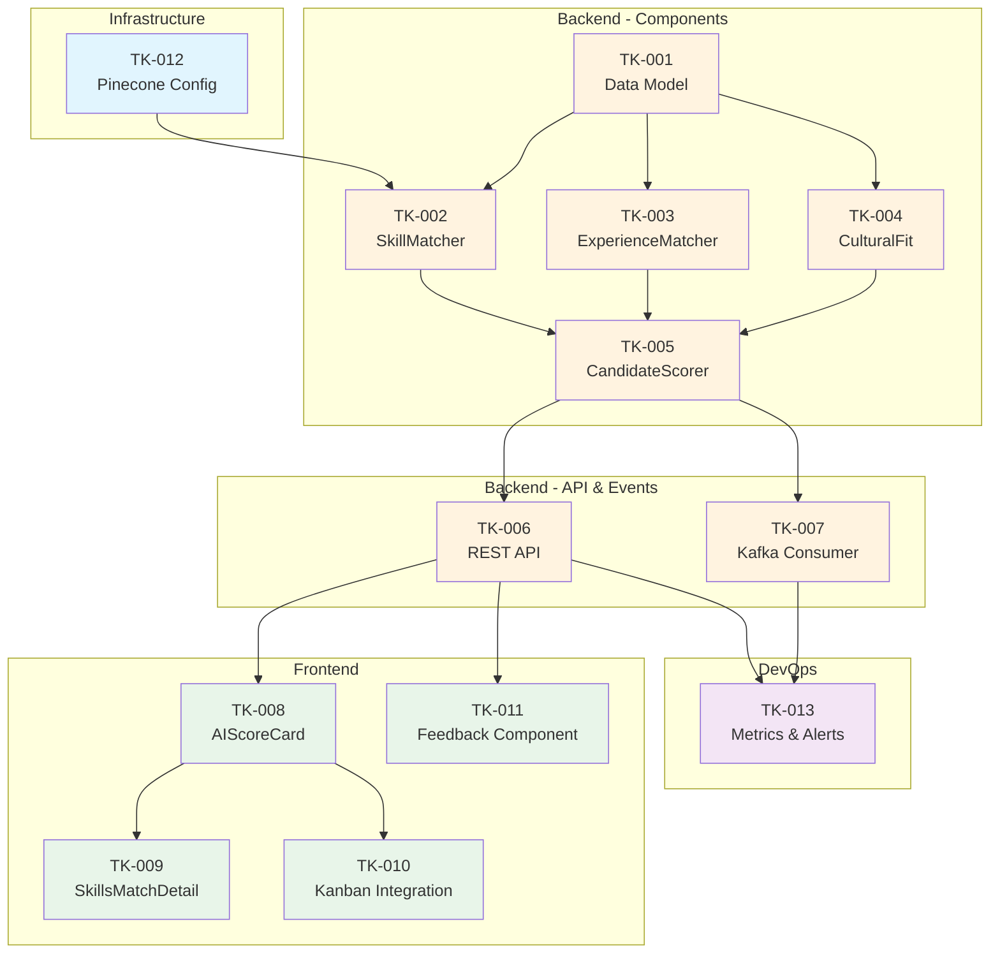

# Tickets de Trabajo - US-005: Scoring Automático de Candidatos con IA

## User Story de Referencia

**US-005: Scoring Automático de Candidatos con IA**

**Como** Recruiter
**Quiero** que el sistema calcule automáticamente un score de match para cada candidato
**Para** priorizar mi tiempo en los candidatos más relevantes para el puesto

---

## Desglose Técnico

La implementación de esta User Story se divide en los siguientes tickets de trabajo, organizados por componentes de la arquitectura.

---

## EPIC: AI Scoring System

### Tickets Backend - AI Service

---

### TK-001: Diseño e Implementación del Modelo de Datos para AI Score

**Tipo**: Backend
**Componente**: Database / AI Service
**Prioridad**: Alta (Blocker)

#### Descripción
Crear las estructuras de base de datos necesarias para almacenar los scores calculados por IA, incluyendo el score general, desglose por categorías y metadatos del cálculo.

#### Tareas Técnicas
- [ ] Crear migración para tabla `ai_score` en PostgreSQL:
  ```sql
  CREATE TABLE ai_score (
    id UUID PRIMARY KEY DEFAULT gen_random_uuid(),
    application_id UUID NOT NULL REFERENCES application(id) ON DELETE CASCADE,
    overall_score DECIMAL(5,2) NOT NULL CHECK (overall_score >= 0 AND overall_score <= 100),
    skill_matches JSONB NOT NULL DEFAULT '{}',
    experience_match JSONB NOT NULL DEFAULT '{}',
    education_match JSONB NOT NULL DEFAULT '{}',
    cultural_fit JSONB NOT NULL DEFAULT '{}',
    summary TEXT,
    confidence DECIMAL(3,2) CHECK (confidence >= 0 AND confidence <= 1),
    model_version VARCHAR(50) NOT NULL,
    calculated_at TIMESTAMP WITH TIME ZONE DEFAULT NOW(),
    calculation_time_ms INTEGER,
    created_at TIMESTAMP WITH TIME ZONE DEFAULT NOW(),
    updated_at TIMESTAMP WITH TIME ZONE DEFAULT NOW(),
    UNIQUE(application_id)
  );
  ```
- [ ] Crear índices para optimizar consultas:
  ```sql
  CREATE INDEX idx_ai_score_application ON ai_score(application_id);
  CREATE INDEX idx_ai_score_overall ON ai_score(overall_score DESC);
  CREATE INDEX idx_ai_score_calculated ON ai_score(calculated_at);
  ```
- [ ] Crear modelo SQLAlchemy/Pydantic en Python
- [ ] Implementar repository pattern para operaciones CRUD
- [ ] Escribir tests unitarios para el repository

#### Criterios de Aceptación
- [ ] Migración ejecuta sin errores en ambiente de desarrollo y staging
- [ ] El modelo Pydantic valida correctamente todos los campos
- [ ] Tests unitarios pasan con >90% cobertura
- [ ] Índices mejoran performance de consultas (benchmark documentado)

#### Definición de Done
- [ ] PR aprobado por 2 revisores
- [ ] Migración aplicada en staging
- [ ] Documentación de schema actualizada
- [ ] Tests pasando en CI

#### Estimación: 3 puntos de historia (Fibonacci)
#### Estimación en horas: 6-8 horas

---

### TK-002: Implementación del SkillMatcher Component

**Tipo**: Backend
**Componente**: AI Service - Candidate Scorer
**Prioridad**: Alta

#### Descripción
Implementar el componente `SkillMatcher` que extrae skills del CV del candidato y calcula el porcentaje de match con los requisitos del puesto usando embeddings semánticos.

#### Tareas Técnicas
- [ ] Crear clase `SkillMatcher` en `ai_service/components/skill_matcher.py`:
  ```python
  class SkillMatcher:
      def __init__(self, embedding_generator: EmbeddingGenerator):
          self.embedder = embedding_generator

      async def extract_skills(self, text: str) -> List[Skill]
      async def match_skills(
          self,
          candidate_skills: List[Skill],
          required_skills: List[Skill]
      ) -> SkillMatch
      def calculate_similarity(self, skill1: Skill, skill2: Skill) -> float
  ```
- [ ] Implementar extracción de skills usando spaCy NER + LLM fallback
- [ ] Implementar matching semántico usando cosine similarity de embeddings
- [ ] Crear dataclasses para `Skill`, `SkillPair`, `SkillMatch`
- [ ] Implementar cache de embeddings de skills comunes
- [ ] Manejar sinónimos y variaciones (ej: "JS" = "JavaScript")
- [ ] Escribir tests unitarios con casos edge (skills ambiguos, idiomas mixtos)

#### Criterios de Aceptación
- [ ] Extrae correctamente skills técnicas de CVs en inglés y español
- [ ] Similarity threshold configurable (default 0.75)
- [ ] Tiempo de procesamiento < 2 segundos por CV
- [ ] Maneja gracefully CVs sin skills identificables
- [ ] Tests con fixtures de CVs reales (anonimizados)

#### Definición de Done
- [ ] PR aprobado
- [ ] Tests unitarios >85% cobertura
- [ ] Documentación de API interna
- [ ] Logging estructurado implementado

#### Dependencias
- TK-001: Modelo de datos
- EmbeddingGenerator existente

#### Estimación: 8 puntos de historia
#### Estimación en horas: 16-20 horas

---

### TK-003: Implementación del ExperienceMatcher Component

**Tipo**: Backend
**Componente**: AI Service - Candidate Scorer
**Prioridad**: Alta

#### Descripción
Implementar el componente `ExperienceMatcher` que analiza la experiencia laboral del candidato y calcula el grado de match con los requisitos de experiencia del puesto.

#### Tareas Técnicas
- [ ] Crear clase `ExperienceMatcher` en `ai_service/components/experience_matcher.py`:
  ```python
  class ExperienceMatcher:
      def __init__(self, llm_client: LLMClient):
          self.llm = llm_client

      async def analyze_experience(
          self,
          cv_text: str,
          requirements: str
      ) -> ExperienceMatch

      def calculate_years_match(
          self,
          candidate_years: int,
          required_years: int
      ) -> float

      async def analyze_industry_relevance(
          self,
          experiences: List[Experience],
          target_industry: str
      ) -> float
  ```
- [ ] Implementar extracción de años de experiencia con regex + LLM validation
- [ ] Crear scoring de progresión de carrera (junior→senior)
- [ ] Implementar análisis de relevancia de industria
- [ ] Crear prompt template para análisis de LLM
- [ ] Implementar fallback para CVs con formato no estándar
- [ ] Escribir tests unitarios y de integración

#### Criterios de Aceptación
- [ ] Extrae años de experiencia con precisión >90% en test set
- [ ] Identifica correctamente niveles de seniority
- [ ] Reconoce industrias relevantes vs no relevantes
- [ ] Funciona con experiencias en múltiples idiomas
- [ ] Tiempo de procesamiento < 3 segundos

#### Definición de Done
- [ ] PR aprobado
- [ ] Tests unitarios >85% cobertura
- [ ] Prompt templates versionados en Prompt Manager
- [ ] Métricas de precisión documentadas

#### Dependencias
- TK-001: Modelo de datos
- LLMClient existente

#### Estimación: 8 puntos de historia
#### Estimación en horas: 16-20 horas

---

### TK-004: Implementación del CulturalFitAnalyzer Component

**Tipo**: Backend
**Componente**: AI Service - Candidate Scorer
**Prioridad**: Media

#### Descripción
Implementar el componente `CulturalFitAnalyzer` que analiza indicadores de fit cultural del candidato basándose en el contenido del CV, carta de presentación (si existe), y los valores declarados de la organización.

#### Tareas Técnicas
- [ ] Crear clase `CulturalFitAnalyzer` en `ai_service/components/cultural_fit.py`:
  ```python
  class CulturalFitAnalyzer:
      def __init__(self, llm_client: LLMClient, prompt_manager: PromptManager):
          self.llm = llm_client
          self.prompts = prompt_manager

      async def analyze_fit(
          self,
          candidate_profile: CandidateProfile,
          org_values: List[str]
      ) -> CulturalFit

      def extract_indicators(self, text: str) -> List[CulturalIndicator]

      def score_alignment(
          self,
          indicators: List[CulturalIndicator],
          values: List[str]
      ) -> float
  ```
- [ ] Definir lista de indicadores culturales estándar:
  - Trabajo en equipo vs trabajo individual
  - Innovación vs estabilidad
  - Ritmo de trabajo
  - Estilo de comunicación
- [ ] Crear prompts para extracción de indicadores con LLM
- [ ] Implementar scoring de alineación valores-indicadores
- [ ] Manejar ausencia de información (score neutral, no penalizar)
- [ ] Escribir tests con casos diversos

#### Criterios de Aceptación
- [ ] Extrae al menos 3 indicadores relevantes de CVs típicos
- [ ] No produce false positives/negatives con CVs neutrales
- [ ] Score se mantiene en rango 0-100 incluso con datos incompletos
- [ ] Genera explicación legible de concerns/positive indicators
- [ ] Tiempo de procesamiento < 4 segundos

#### Definición de Done
- [ ] PR aprobado
- [ ] Tests unitarios >80% cobertura
- [ ] Prompts revisados por equipo de Producto (evitar bias)
- [ ] Documentación de limitaciones del análisis

#### Dependencias
- TK-001: Modelo de datos
- LLMClient y PromptManager existentes

#### Estimación: 5 puntos de historia
#### Estimación en horas: 10-12 horas

---

### TK-005: Implementación del CandidateScorer Orchestrator

**Tipo**: Backend
**Componente**: AI Service - Candidate Scorer
**Prioridad**: Alta

#### Descripción
Implementar el orquestador principal `CandidateScorer` que coordina todos los componentes de scoring, calcula el score final ponderado, y genera el resumen ejecutivo del candidato.

#### Tareas Técnicas
- [ ] Crear clase `CandidateScorer` en `ai_service/components/candidate_scorer.py`:
  ```python
  class CandidateScorer:
      def __init__(
          self,
          skill_matcher: SkillMatcher,
          experience_matcher: ExperienceMatcher,
          cultural_fit_analyzer: CulturalFitAnalyzer,
          config: ScoringConfig
      ):
          ...

      async def calculate_score(
          self,
          application: Application
      ) -> AIScore

      async def batch_score(
          self,
          applications: List[Application]
      ) -> List[AIScore]

      def generate_summary(
          self,
          scores: ScoreComponents
      ) -> str
  ```
- [ ] Implementar ponderación configurable:
  ```python
  DEFAULT_WEIGHTS = {
      "skills": 0.40,
      "experience": 0.35,
      "cultural_fit": 0.15,
      "education": 0.10
  }
  ```
- [ ] Implementar cálculo de score overall:
  ```python
  overall = sum(score * weight for score, weight in zip(scores, weights))
  ```
- [ ] Implementar generación de summary con LLM
- [ ] Implementar batch processing con concurrencia controlada
- [ ] Agregar métricas de tiempo de procesamiento
- [ ] Implementar retry logic para failures transitorios
- [ ] Escribir tests de integración end-to-end

#### Criterios de Aceptación
- [ ] Score final es promedio ponderado de componentes
- [ ] Pesos son configurables por organización
- [ ] Batch de 100 candidatos procesa en < 5 minutos
- [ ] Genera summary de 2-3 oraciones coherentes
- [ ] Handles gracefully errores en componentes individuales
- [ ] Registra confidence score basado en calidad de datos

#### Definición de Done
- [ ] PR aprobado
- [ ] Tests de integración pasando
- [ ] Performance benchmarks documentados
- [ ] Retry policy documentada

#### Dependencias
- TK-002: SkillMatcher
- TK-003: ExperienceMatcher
- TK-004: CulturalFitAnalyzer

#### Estimación: 8 puntos de historia
#### Estimación en horas: 16-20 horas

---

### TK-006: API REST para Scoring

**Tipo**: Backend
**Componente**: AI Service - API Controller
**Prioridad**: Alta

#### Descripción
Implementar los endpoints REST para solicitar cálculo de score, consultar scores existentes, y proporcionar feedback sobre la precisión.

#### Tareas Técnicas
- [ ] Crear endpoints en FastAPI:
  ```python
  @router.post("/applications/{application_id}/score")
  async def calculate_score(application_id: UUID) -> AIScoreResponse

  @router.get("/applications/{application_id}/score")
  async def get_score(application_id: UUID) -> AIScoreResponse

  @router.post("/applications/{application_id}/score/feedback")
  async def submit_feedback(
      application_id: UUID,
      feedback: ScoreFeedback
  ) -> FeedbackResponse

  @router.post("/jobs/{job_id}/batch-score")
  async def batch_score_job(job_id: UUID) -> BatchScoreResponse
  ```
- [ ] Implementar validación de permisos (user debe tener acceso a la application)
- [ ] Implementar rate limiting para endpoints de scoring
- [ ] Agregar OpenAPI documentation
- [ ] Implementar response caching para GET score
- [ ] Escribir tests de API

#### Criterios de Aceptación
- [ ] Endpoints documentados en OpenAPI/Swagger
- [ ] Autenticación JWT validada
- [ ] Rate limit: 10 scores/minuto por usuario
- [ ] Response time < 500ms para GET cached
- [ ] Batch endpoint acepta max 100 applications

#### Definición de Done
- [ ] PR aprobado
- [ ] Tests de API >90% cobertura
- [ ] Documentación OpenAPI actualizada
- [ ] Rate limiting configurado en Kong

#### Dependencias
- TK-005: CandidateScorer
- Auth Service (existente)

#### Estimación: 5 puntos de historia
#### Estimación en horas: 10-12 horas

---

### TK-007: Event Consumer para Scoring Automático

**Tipo**: Backend
**Componente**: AI Service - Event Consumer
**Prioridad**: Alta

#### Descripción
Implementar el consumer de Kafka que escucha eventos de nuevas aplicaciones (cv.uploaded) y dispara automáticamente el cálculo de score.

#### Tareas Técnicas
- [ ] Crear consumer de Kafka en `ai_service/consumers/scoring_consumer.py`:
  ```python
  class ScoringConsumer:
      def __init__(self, scorer: CandidateScorer):
          self.scorer = scorer

      async def handle_cv_uploaded(self, event: CVUploadedEvent):
          # Calcular score automáticamente
          score = await self.scorer.calculate_score(event.application_id)
          # Publicar resultado
          await self.publish_score_calculated(score)

      async def publish_score_calculated(self, score: AIScore):
          # Evento score.calculated para otros servicios
          ...
  ```
- [ ] Configurar consumer group y partitioning
- [ ] Implementar dead-letter queue para eventos fallidos
- [ ] Agregar retry policy exponencial
- [ ] Implementar idempotency check (no re-procesar mismo application_id)
- [ ] Agregar métricas de procesamiento (lag, throughput, errors)
- [ ] Escribir tests de integración con Kafka

#### Criterios de Aceptación
- [ ] Consumer procesa eventos en < 30 segundos tras publicación
- [ ] No hay pérdida de eventos (at-least-once delivery)
- [ ] Eventos duplicados son detectados y ignorados
- [ ] Dead-letter queue funcional para debugging
- [ ] Métricas visibles en Prometheus/Grafana

#### Definición de Done
- [ ] PR aprobado
- [ ] Tests de integración pasando
- [ ] Consumer desplegado en staging
- [ ] Alertas configuradas para consumer lag

#### Dependencias
- TK-005: CandidateScorer
- Kafka infrastructure (existente)

#### Estimación: 5 puntos de historia
#### Estimación en horas: 10-12 horas

---

### Tickets Frontend

---

### TK-008: Componente de Visualización de Score

**Tipo**: Frontend
**Componente**: Web App - React
**Prioridad**: Alta

#### Descripción
Implementar el componente React que muestra el AI Score en el perfil del candidato, incluyendo el score general, el desglose por categorías, y el resumen ejecutivo.

#### Tareas Técnicas
- [ ] Crear componente `AIScoreCard` en `components/candidates/AIScoreCard.tsx`:
  ```tsx
  interface AIScoreCardProps {
    score: AIScore;
    isLoading: boolean;
    onRefresh: () => void;
  }

  export const AIScoreCard: React.FC<AIScoreCardProps> = ({...}) => {
    // Score circular gauge
    // Category breakdown bars
    // Summary text
    // Refresh button
  }
  ```
- [ ] Implementar gauge circular para score overall (0-100)
- [ ] Implementar código de colores:
  - Verde: >70
  - Amarillo: 40-70
  - Rojo: <40
- [ ] Crear barras de progreso para cada categoría (Skills, Experience, Cultural Fit)
- [ ] Implementar tooltip con detalles al hover sobre cada categoría
- [ ] Crear skeleton loader para estado de carga
- [ ] Implementar estado de error con retry
- [ ] Escribir tests unitarios con React Testing Library

#### Criterios de Aceptación
- [ ] Score se muestra correctamente en rangos 0-100
- [ ] Colores corresponden a rangos definidos
- [ ] Tooltips muestran información adicional
- [ ] Loading state visible durante cálculo
- [ ] Componente es accesible (a11y compliant)
- [ ] Responsive en mobile y desktop

#### Definición de Done
- [ ] PR aprobado
- [ ] Tests unitarios >80% cobertura
- [ ] Storybook stories creadas
- [ ] Revisión de UX/Design aprobada

#### Dependencias
- TK-006: API endpoints disponibles
- Design system existente

#### Estimación: 5 puntos de historia
#### Estimación en horas: 10-12 horas

---

### TK-009: Componente de Desglose de Skills Match

**Tipo**: Frontend
**Componente**: Web App - React
**Prioridad**: Media

#### Descripción
Implementar el componente expandible que muestra el detalle del match de skills, incluyendo skills coincidentes, skills faltantes, y skills adicionales del candidato.

#### Tareas Técnicas
- [ ] Crear componente `SkillsMatchDetail` en `components/candidates/SkillsMatchDetail.tsx`:
  ```tsx
  interface SkillsMatchDetailProps {
    skillMatch: SkillMatch;
    isExpanded: boolean;
    onToggle: () => void;
  }
  ```
- [ ] Implementar lista de skills con iconos:
  - ✅ Skill coincidente
  - ❌ Skill faltante (requerido)
  - ➕ Skill adicional (bonus)
- [ ] Mostrar porcentaje de match por skill (si hay partial match)
- [ ] Implementar collapse/expand animation
- [ ] Agregar search/filter dentro del listado de skills
- [ ] Escribir tests unitarios

#### Criterios de Aceptación
- [ ] Skills se categorizan correctamente
- [ ] Iconografía clara y consistente
- [ ] Filter funciona en tiempo real
- [ ] Animación de expand es fluida
- [ ] Lista scrollable si hay muchos skills

#### Definición de Done
- [ ] PR aprobado
- [ ] Tests unitarios pasando
- [ ] Storybook stories
- [ ] Aprobación de diseño

#### Dependencias
- TK-008: AIScoreCard (se integra aquí)

#### Estimación: 3 puntos de historia
#### Estimación en horas: 6-8 horas

---

### TK-010: Integración de Score en Pipeline Kanban

**Tipo**: Frontend
**Componente**: Web App - React
**Prioridad**: Alta

#### Descripción
Integrar la visualización del AI Score en las tarjetas de candidatos del Pipeline Kanban, permitiendo ordenar candidatos por score y filtrar por rangos.

#### Tareas Técnicas
- [ ] Modificar componente `CandidateCard` para incluir score badge:
  ```tsx
  // En CandidateCard.tsx
  <ScoreBadge score={candidate.aiScore} size="sm" />
  ```
- [ ] Implementar sorting por score en columnas del Kanban:
  ```tsx
  const sortedCandidates = useMemo(() =>
    candidates.sort((a, b) => b.aiScore - a.aiScore),
    [candidates, sortBy]
  );
  ```
- [ ] Implementar filtro por rango de score:
  - Slider de rango (min-max)
  - Quick filters: "Top 25%", "Above Average", "All"
- [ ] Actualizar score en tiempo real via WebSocket cuando se recalcula
- [ ] Escribir tests de integración

#### Criterios de Aceptación
- [ ] Score visible en cada tarjeta de candidato
- [ ] Sorting por score funciona correctamente
- [ ] Filtros de rango funcionan en tiempo real
- [ ] WebSocket actualiza scores sin refresh
- [ ] Performance: <100ms para re-render con 100 candidatos

#### Definición de Done
- [ ] PR aprobado
- [ ] Tests de integración pasando
- [ ] No regresión en performance del Kanban

#### Dependencias
- TK-008: Componente AIScoreCard
- US-002: Pipeline Kanban implementado

#### Estimación: 5 puntos de historia
#### Estimación en horas: 10-12 horas

---

### TK-011: Componente de Feedback de Score

**Tipo**: Frontend
**Componente**: Web App - React
**Prioridad**: Media

#### Descripción
Implementar el mecanismo para que recruiters proporcionen feedback sobre la precisión del score (thumbs up/down), permitiendo mejorar el modelo con el tiempo.

#### Tareas Técnicas
- [ ] Crear componente `ScoreFeedback` en `components/candidates/ScoreFeedback.tsx`:
  ```tsx
  interface ScoreFeedbackProps {
    scoreId: UUID;
    onFeedback: (isAccurate: boolean, comment?: string) => void;
  }

  // UI: 👍 / 👎 buttons + optional comment modal
  ```
- [ ] Implementar modal para comentario opcional:
  - "¿Por qué este score no es preciso?"
  - Opciones predefinidas + texto libre
- [ ] Implementar llamada a API de feedback
- [ ] Agregar toast de confirmación
- [ ] Track feedback en analytics
- [ ] Escribir tests unitarios

#### Criterios de Aceptación
- [ ] Feedback se envía correctamente al backend
- [ ] Usuario puede añadir comentario opcional
- [ ] No se puede enviar feedback múltiple para mismo score
- [ ] Feedback enviado se refleja en UI (botón deshabilitado)

#### Definición de Done
- [ ] PR aprobado
- [ ] Tests unitarios pasando
- [ ] Analytics events configurados

#### Dependencias
- TK-006: API de feedback

#### Estimación: 3 puntos de historia
#### Estimación en horas: 6-8 horas

---

### Tickets DevOps/Infra

---

### TK-012: Configuración de Vector Database (Pinecone)

**Tipo**: Infrastructure
**Componente**: Data Layer
**Prioridad**: Alta (Blocker)

#### Descripción
Configurar Pinecone como base de datos vectorial para almacenar embeddings de candidatos y ofertas, habilitando búsqueda semántica de skills.

#### Tareas Técnicas
- [ ] Crear index en Pinecone:
  ```
  Name: lti-embeddings-{env}
  Dimension: 1536 (OpenAI ada-002)
  Metric: cosine
  Pod type: s1 (starter) → p2 (production)
  ```
- [ ] Configurar namespaces:
  - `skills`: embeddings de skills
  - `candidates`: embeddings de perfiles
  - `jobs`: embeddings de ofertas
- [ ] Implementar client wrapper en Python:
  ```python
  class VectorStore:
      async def upsert(self, vectors: List[Vector], namespace: str)
      async def query(self, vector: List[float], top_k: int, namespace: str)
      async def delete(self, ids: List[str], namespace: str)
  ```
- [ ] Configurar secrets en Kubernetes:
  - PINECONE_API_KEY
  - PINECONE_ENVIRONMENT
- [ ] Escribir tests de integración
- [ ] Documentar estrategia de retention/cleanup

#### Criterios de Aceptación
- [ ] Index creado en dev, staging, prod
- [ ] Client wrapper funcional con retry logic
- [ ] Latencia de query < 100ms p95
- [ ] Secrets configurados de forma segura
- [ ] Backup strategy documentada

#### Definición de Done
- [ ] Infrastructure as Code (Terraform) committeado
- [ ] Tests de integración pasando
- [ ] Runbook de operaciones documentado

#### Estimación: 5 puntos de historia
#### Estimación en horas: 10-12 horas

---

### TK-013: Configuración de Métricas y Alertas para AI Scoring

**Tipo**: DevOps
**Componente**: Observability
**Prioridad**: Media

#### Descripción
Configurar métricas, dashboards y alertas específicas para el sistema de AI Scoring, permitiendo monitorear performance, costos de LLM, y calidad de scores.

#### Tareas Técnicas
- [ ] Definir métricas en Prometheus:
  ```yaml
  ai_scoring_duration_seconds: histogram
  ai_scoring_requests_total: counter (labels: status, model_version)
  ai_scoring_llm_tokens_used: counter (labels: provider, model)
  ai_scoring_llm_cost_usd: counter
  ai_scoring_accuracy_feedback: gauge (labels: feedback_type)
  ai_scoring_cache_hit_ratio: gauge
  ```
- [ ] Crear dashboard en Grafana:
  - Scoring throughput y latencia
  - LLM costs por día/semana
  - Distribución de scores (histograma)
  - Feedback positivo vs negativo
  - Cache hit ratio
- [ ] Configurar alertas:
  - Latencia p95 > 30s → Warning
  - Error rate > 5% → Critical
  - LLM cost spike > 2x normal → Warning
  - Feedback negativo > 30% → Warning
- [ ] Configurar PagerDuty integration para critical alerts

#### Criterios de Aceptación
- [ ] Dashboard funcional con datos reales
- [ ] Alertas disparan correctamente (tested)
- [ ] PagerDuty notifica al oncall
- [ ] Costo de LLM trackeable día a día

#### Definición de Done
- [ ] Dashboard en Grafana staging/prod
- [ ] Alertas configuradas y testeadas
- [ ] Runbook para cada alerta documentado

#### Dependencias
- TK-005, TK-006, TK-007 desplegados

#### Estimación: 3 puntos de historia
#### Estimación en horas: 6-8 horas

---

## Resumen de Tickets

| ID | Título | Tipo | Estimación (pts) | Estimación (hrs) |
|----|--------|------|-----------------|-----------------|
| TK-001 | Modelo de Datos AI Score | Backend | 3 | 6-8h |
| TK-002 | SkillMatcher Component | Backend | 8 | 16-20h |
| TK-003 | ExperienceMatcher Component | Backend | 8 | 16-20h |
| TK-004 | CulturalFitAnalyzer Component | Backend | 5 | 10-12h |
| TK-005 | CandidateScorer Orchestrator | Backend | 8 | 16-20h |
| TK-006 | API REST para Scoring | Backend | 5 | 10-12h |
| TK-007 | Event Consumer Kafka | Backend | 5 | 10-12h |
| TK-008 | Componente AIScoreCard | Frontend | 5 | 10-12h |
| TK-009 | SkillsMatchDetail Component | Frontend | 3 | 6-8h |
| TK-010 | Integración en Pipeline Kanban | Frontend | 5 | 10-12h |
| TK-011 | Componente Feedback | Frontend | 3 | 6-8h |
| TK-012 | Configuración Pinecone | Infra | 5 | 10-12h |
| TK-013 | Métricas y Alertas | DevOps | 3 | 6-8h |

**Total: 66 puntos de historia**

---

## Diagrama de Dependencias



---

## Plan de Sprints Sugerido

### Sprint 1 (Semana 1-2)
**Objetivo**: Foundations

| Ticket | Owner | Puntos |
|--------|-------|--------|
| TK-001 | Backend Dev | 3 |
| TK-012 | DevOps | 5 |
| TK-002 | Backend Dev | 8 |
| TK-008 | Frontend Dev | 5 |

**Total: 21 puntos**

### Sprint 2 (Semana 3-4)
**Objetivo**: Core Scoring

| Ticket | Owner | Puntos |
|--------|-------|--------|
| TK-003 | Backend Dev | 8 |
| TK-004 | Backend Dev | 5 |
| TK-005 | Backend Dev | 8 |

**Total: 21 puntos**

### Sprint 3 (Semana 5-6)
**Objetivo**: Integration & Polish

| Ticket | Owner | Puntos |
|--------|-------|--------|
| TK-006 | Backend Dev | 5 |
| TK-007 | Backend Dev | 5 |
| TK-009 | Frontend Dev | 3 |
| TK-010 | Frontend Dev | 5 |
| TK-011 | Frontend Dev | 3 |
| TK-013 | DevOps | 3 |

**Total: 24 puntos**

---

## Notas de Implementación

### Consideraciones de Performance
- Usar batch processing para scoring de múltiples candidatos
- Implementar cache de embeddings de skills frecuentes
- Usar async/await para llamadas a LLM en paralelo

### Consideraciones de Seguridad
- No almacenar CV raw después de parsing (solo datos estructurados)
- Logs no deben contener PII
- Rate limiting estricto en endpoints de scoring

### Consideraciones de Testing
- Mock de LLM para tests unitarios (deterministic responses)
- Fixtures con CVs anonimizados para tests de integración
- Load testing del batch endpoint antes de producción
