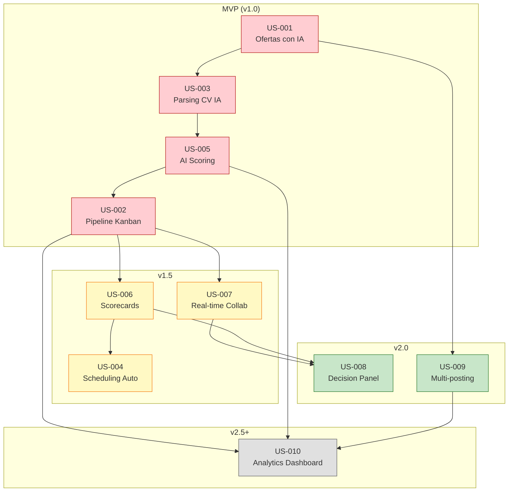
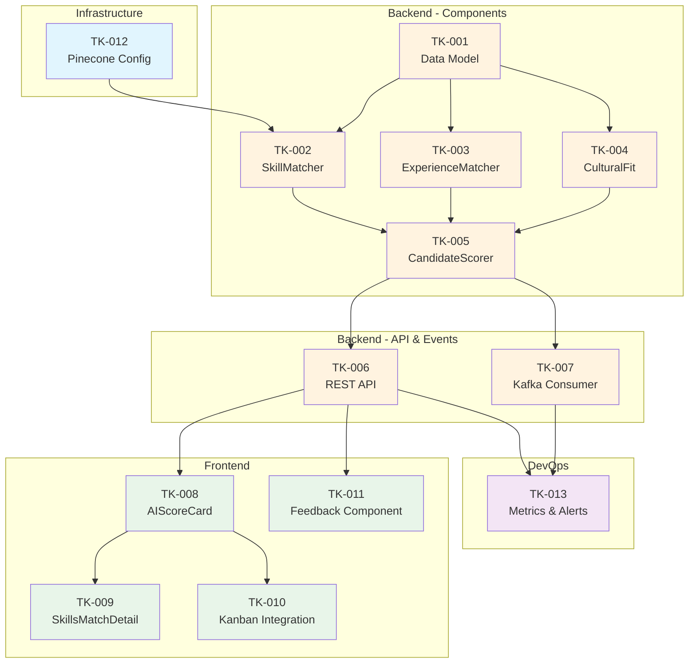

# Documentación Consolidada - LTI ATS Backlog

Este documento consolida toda la documentación de Product Backlog del proyecto LTI ATS.

---

# Parte 1: User Stories - LTI ATS

## Plantilla Utilizada

Todas las User Stories siguen esta plantilla estándar:

```
## US-[ID]: [Título]

**Como** [rol del usuario]
**Quiero** [acción/funcionalidad deseada]
**Para** [beneficio/valor que obtiene]

### Descripción
[Contexto adicional y detalles de la historia]

### Criterios de Aceptación
- [ ] [Criterio verificable 1]
- [ ] [Criterio verificable 2]
- [ ] [Criterio verificable N]

### Notas Técnicas
[Consideraciones de implementación, dependencias, etc.]

### Definición de Done (DoD)
- [ ] Código implementado y revisado (code review)
- [ ] Tests unitarios escritos y pasando (>80% cobertura)
- [ ] Tests de integración pasando
- [ ] Documentación actualizada
- [ ] Desplegado en ambiente de staging
- [ ] Aprobación del Product Owner

### Mockups/Wireframes
[Referencias visuales si aplica]

### Dependencias
[Otras US o componentes necesarios]

### Prioridad: [Alta/Media/Baja]
### Estimación: [Puntos de historia]
```

---

## User Stories del Sistema LTI

---

## US-001: Creación de Ofertas de Empleo con Asistencia de IA

**Como** Recruiter
**Quiero** crear ofertas de empleo con asistencia de inteligencia artificial
**Para** generar descripciones optimizadas en menos tiempo y con mejor calidad

### Descripción
El recruiter necesita poder crear nuevas ofertas de empleo de manera eficiente. El sistema debe proporcionar asistencia de IA que genere automáticamente la descripción del puesto, requisitos y beneficios basándose en el título del puesto y algunos parámetros básicos. El recruiter debe poder editar y personalizar el contenido generado antes de publicar.

### Criterios de Aceptación
- [ ] El usuario puede acceder al formulario de creación de oferta desde el dashboard principal
- [ ] Al ingresar el título del puesto, el sistema sugiere una categoría/departamento
- [ ] Existe un botón "Generar con IA" que activa la generación automática
- [ ] La IA genera: descripción del puesto, requisitos (mínimos y deseables), beneficios
- [ ] El contenido generado se muestra en campos editables
- [ ] El usuario puede regenerar secciones individuales si no está satisfecho
- [ ] El sistema guarda borradores automáticamente cada 30 segundos
- [ ] La oferta puede guardarse como borrador o publicarse directamente
- [ ] El tiempo de generación de IA no excede 10 segundos
- [ ] Se muestra indicador de carga durante la generación

### Notas Técnicas
- Integración con AI Service (Content Generator component)
- Uso de LangChain para orquestación de prompts
- Almacenamiento en PostgreSQL (tabla `job_posting`)
- Endpoint: `POST /api/v1/jobs` y `POST /api/v1/jobs/{id}/generate`
- Cache de respuestas frecuentes en Redis para optimizar costos LLM

### Definición de Done (DoD)
- [ ] Código implementado y revisado (code review)
- [ ] Tests unitarios escritos y pasando (>80% cobertura)
- [ ] Tests de integración pasando
- [ ] Documentación de API actualizada (OpenAPI)
- [ ] Desplegado en ambiente de staging
- [ ] Aprobación del Product Owner
- [ ] Métricas de uso de IA configuradas en Prometheus

### Mockups/Wireframes
- Wireframe del formulario de creación con botón de IA
- Estado de loading durante generación
- Vista de edición post-generación

### Dependencias
- Infrastructure: AI Service desplegado
- Data: Prompts de generación configurados en Prompt Manager
- Auth: Sistema de autenticación funcional

### Prioridad: Alta
### Estimación: 13 puntos de historia

---

## US-002: Visualización de Pipeline de Candidatos en Kanban

**Como** Recruiter
**Quiero** visualizar y gestionar candidatos en un tablero Kanban
**Para** tener una vista clara del estado de cada candidato y moverlos entre etapas fácilmente

### Descripción
El sistema debe proporcionar una vista tipo Kanban donde el recruiter pueda ver todos los candidatos de una oferta organizados por etapas del pipeline (Applied, Screening, Interview, Offer, Hired/Rejected). Los candidatos deben poder moverse entre columnas mediante drag & drop, y cada tarjeta debe mostrar información resumida del candidato incluyendo su AI Score.

### Criterios de Aceptación
- [ ] El tablero Kanban muestra todas las etapas del pipeline configuradas para la oferta
- [ ] Cada candidato se representa como una tarjeta con: nombre, foto, AI Score, fecha de aplicación
- [ ] El AI Score se muestra con código de colores (verde >70, amarillo 40-70, rojo <40)
- [ ] Las tarjetas pueden arrastrarse y soltarse entre columnas
- [ ] Al mover una tarjeta, se actualiza el estado en tiempo real
- [ ] Se muestra un contador de candidatos por columna
- [ ] Existe filtro por AI Score (rango), fecha de aplicación y fuente
- [ ] El tablero se actualiza en tiempo real cuando otro usuario hace cambios
- [ ] Se puede cambiar entre vista Kanban, Lista y Tabla
- [ ] Al hacer clic en una tarjeta, se abre el perfil detallado del candidato

### Notas Técnicas
- Frontend: React con react-beautiful-dnd para drag & drop
- WebSocket (Socket.io) para actualizaciones en tiempo real
- Estado optimista para mejor UX al mover tarjetas
- Endpoint: `GET /api/v1/jobs/{id}/pipeline`, `PATCH /api/v1/applications/{id}/stage`
- Collaboration Service para sincronización entre usuarios

### Definición de Done (DoD)
- [ ] Código implementado y revisado (code review)
- [ ] Tests unitarios escritos y pasando (>80% cobertura)
- [ ] Tests E2E para flujo de drag & drop
- [ ] Performance: renderizado <100ms para 100 candidatos
- [ ] Documentación actualizada
- [ ] Desplegado en ambiente de staging
- [ ] Aprobación del Product Owner

### Mockups/Wireframes
- Diseño del tablero Kanban con columnas
- Diseño de tarjeta de candidato
- Estados de hover y dragging

### Dependencias
- US-005: Sistema de scoring de candidatos
- US-003: Gestión básica de candidatos
- Collaboration Service operativo

### Prioridad: Alta
### Estimación: 8 puntos de historia

---

## US-003: Aplicación de Candidatos y Parsing de CV con IA

**Como** Candidato
**Quiero** aplicar a una oferta subiendo mi CV
**Para** que mis datos sean procesados automáticamente sin tener que llenar formularios extensos

### Descripción
Los candidatos deben poder aplicar a ofertas de empleo subiendo su CV. El sistema utilizará IA para extraer automáticamente la información relevante (datos de contacto, experiencia laboral, educación, habilidades) y completar el perfil del candidato. Esto reduce la fricción en el proceso de aplicación y mejora la experiencia del candidato.

### Criterios de Aceptación
- [ ] El candidato puede acceder a la página de aplicación desde la oferta pública
- [ ] Puede subir CV en formatos: PDF, DOCX, DOC (máx. 5MB)
- [ ] El sistema muestra barra de progreso durante el procesamiento
- [ ] El CV es parseado y se extraen: nombre, email, teléfono, LinkedIn, experiencia, educación, habilidades
- [ ] Los datos extraídos se muestran al candidato para confirmación/edición
- [ ] El candidato puede corregir datos incorrectos antes de enviar
- [ ] Se solicita consentimiento GDPR explícito antes de completar la aplicación
- [ ] El candidato recibe email de confirmación al completar la aplicación
- [ ] Si el parsing falla, se muestra formulario manual como fallback
- [ ] El tiempo de parsing no excede 15 segundos

### Notas Técnicas
- AI Service: CV Parser component (spaCy + LLM)
- Almacenamiento de documentos en S3 con cifrado
- Endpoint: `POST /api/v1/public/applications`
- Generación de embeddings para búsqueda semántica posterior
- Evento Kafka `cv.uploaded` para procesamiento asíncrono
- Tabla `candidate_profile` para datos estructurados

### Definición de Done (DoD)
- [ ] Código implementado y revisado (code review)
- [ ] Tests unitarios escritos y pasando (>80% cobertura)
- [ ] Tests de integración con AI Service
- [ ] Validación de seguridad (sanitización de archivos)
- [ ] Documentación actualizada
- [ ] Desplegado en ambiente de staging
- [ ] Aprobación del Product Owner

### Mockups/Wireframes
- Página de aplicación con upload de CV
- Vista de confirmación de datos extraídos
- Email de confirmación

### Dependencias
- AI Service: CV Parser operativo
- Storage: S3 bucket configurado
- Email Service: Templates configurados

### Prioridad: Alta
### Estimación: 13 puntos de historia

---

## US-004: Programación Automática de Entrevistas

**Como** Recruiter
**Quiero** que el sistema coordine automáticamente la programación de entrevistas
**Para** eliminar el trabajo manual de encontrar horarios compatibles entre candidato y entrevistadores

### Descripción
El sistema debe integrar los calendarios de los entrevistadores (Google Calendar, Outlook) y proponer automáticamente horarios disponibles al candidato. El candidato selecciona su horario preferido y el sistema crea el evento en todos los calendarios, envía confirmaciones y configura recordatorios automáticos.

### Criterios de Aceptación
- [ ] El recruiter puede seleccionar candidato y tipo de entrevista (phone, video, onsite)
- [ ] El recruiter asigna entrevistadores al proceso
- [ ] El sistema consulta disponibilidad de calendarios conectados
- [ ] Se calculan slots óptimos considerando zonas horarias de todos los participantes
- [ ] Se presentan al recruiter los 5 mejores slots disponibles
- [ ] El recruiter aprueba el envío de propuesta al candidato
- [ ] El candidato recibe link con opciones de horario
- [ ] El candidato puede seleccionar su preferencia
- [ ] Al confirmar, se crean eventos en todos los calendarios
- [ ] Se envían confirmaciones con link de videoconferencia (Zoom/Teams/Meet)
- [ ] Se programan recordatorios automáticos (24h y 1h antes)
- [ ] Si el candidato no responde en 48h, se envía reminder automático

### Notas Técnicas
- Scheduling Service con Temporal para workflows
- Integración OAuth con Google Calendar y Microsoft Graph API
- Endpoint: `POST /api/v1/interviews/schedule`
- Manejo de zonas horarias con moment-timezone
- Generación de links de videoconferencia vía API (Zoom/Teams)
- Eventos Kafka para notificaciones

### Definición de Done (DoD)
- [ ] Código implementado y revisado (code review)
- [ ] Tests unitarios escritos y pasando (>80% cobertura)
- [ ] Tests de integración con APIs de calendario
- [ ] Manejo de errores para calendarios desconectados
- [ ] Documentación actualizada
- [ ] Desplegado en ambiente de staging
- [ ] Aprobación del Product Owner

### Mockups/Wireframes
- Modal de programación de entrevista
- Email de propuesta al candidato
- Página de selección de horario para candidato
- Evento de calendario creado

### Dependencias
- Integraciones: Google Calendar OAuth, Microsoft Graph API
- Notification Service operativo
- Configuración de Zoom/Teams/Meet API

### Prioridad: Alta
### Estimación: 21 puntos de historia

---

## US-005: Scoring Automático de Candidatos con IA

**Como** Recruiter
**Quiero** que el sistema calcule automáticamente un score de match para cada candidato
**Para** priorizar mi tiempo en los candidatos más relevantes para el puesto

### Descripción
Cuando un candidato aplica a una oferta, el sistema debe calcular automáticamente un score de 0-100 que represente qué tan bien encaja el candidato con los requisitos del puesto. El score debe considerar skills, experiencia, educación y fit cultural. El recruiter debe poder ver el desglose del score y entender por qué el candidato recibió esa puntuación.

### Criterios de Aceptación
- [ ] El score se calcula automáticamente tras el parsing del CV
- [ ] El score general es un número de 0-100
- [ ] Se muestra desglose en 4 categorías: Skills Match, Experience Match, Education Match, Cultural Fit
- [ ] Cada categoría tiene score individual y explicación en texto
- [ ] Se listan skills coincidentes, faltantes y adicionales
- [ ] El score se actualiza si se modifica el CV o los requisitos del puesto
- [ ] Los candidatos se pueden ordenar por score en cualquier vista
- [ ] El cálculo de score no excede 30 segundos tras la aplicación
- [ ] Se genera un resumen ejecutivo de 2-3 oraciones sobre el candidato
- [ ] El recruiter puede dar feedback sobre la precisión del score (👍/👎)

### Notas Técnicas
- AI Service: Candidate Scorer component
- Uso de embeddings (OpenAI/Cohere) para matching semántico
- Vector DB (Pinecone) para búsqueda de similitud
- Almacenamiento en tabla `ai_score`
- Evento Kafka `score.calculated` para notificaciones
- Endpoint: `GET /api/v1/applications/{id}/score`
- Métricas de feedback para mejora continua del modelo

### Definición de Done (DoD)
- [ ] Código implementado y revisado (code review)
- [ ] Tests unitarios escritos y pasando (>80% cobertura)
- [ ] Tests de integración con AI Service
- [ ] Benchmarks de precisión vs evaluación manual
- [ ] Documentación actualizada
- [ ] Desplegado en ambiente de staging
- [ ] Aprobación del Product Owner

### Mockups/Wireframes
- Tarjeta de score en perfil de candidato
- Vista expandida con desglose de categorías
- Iconografía para skills match/missing

### Dependencias
- US-003: Parsing de CV implementado
- AI Service: Embeddings y Vector DB operativos
- Prompts de scoring configurados

### Prioridad: Alta
### Estimación: 21 puntos de historia

---

## US-006: Evaluación Colaborativa con Scorecards

**Como** Hiring Manager
**Quiero** completar scorecards de evaluación estructuradas después de entrevistar candidatos
**Para** proporcionar feedback consistente y facilitar la comparación entre candidatos

### Descripción
Después de cada entrevista, los evaluadores deben poder completar una scorecard con criterios predefinidos. Cada criterio tiene una escala de puntuación y espacio para notas. Las scorecards permiten evaluar de manera consistente y generar una puntuación agregada para comparar candidatos.

### Criterios de Aceptación
- [ ] Existe un catálogo de scorecards configurables por tipo de entrevista
- [ ] Cada scorecard tiene criterios con nombre, descripción y peso
- [ ] Los criterios se puntúan en escala 1-5 con etiquetas descriptivas
- [ ] Cada criterio tiene campo opcional para notas
- [ ] El evaluador puede añadir una recomendación final: Strong Hire, Hire, No Hire, Strong No Hire
- [ ] Se puede añadir un comentario general sobre la entrevista
- [ ] La scorecard se guarda automáticamente (autosave)
- [ ] Al completar, se notifica al recruiter responsable
- [ ] El recruiter puede ver todas las scorecards de un candidato en un panel consolidado
- [ ] Se calcula score promedio ponderado automáticamente

### Notas Técnicas
- Tablas: `scorecard`, `scorecard_criteria`, `evaluation`, `evaluation_score`
- Endpoint: `POST /api/v1/evaluations`, `GET /api/v1/applications/{id}/evaluations`
- WebSocket para notificaciones en tiempo real
- Cálculo de promedio ponderado en el frontend y backend

### Definición de Done (DoD)
- [ ] Código implementado y revisado (code review)
- [ ] Tests unitarios escritos y pasando (>80% cobertura)
- [ ] Tests de integración
- [ ] Documentación actualizada
- [ ] Desplegado en ambiente de staging
- [ ] Aprobación del Product Owner

### Mockups/Wireframes
- Formulario de scorecard
- Vista de panel consolidado de evaluaciones
- Comparativa visual entre candidatos

### Dependencias
- US-004: Sistema de entrevistas
- Notification Service operativo

### Prioridad: Media
### Estimación: 13 puntos de historia

---

## US-007: Colaboración en Tiempo Real en Perfiles de Candidatos

**Como** Miembro del equipo de contratación
**Quiero** ver en tiempo real quién está viendo el perfil de un candidato y sus comentarios
**Para** colaborar eficientemente y evitar duplicar esfuerzos o tomar decisiones desinformadas

### Descripción
Inspirado en herramientas como Figma y Notion, el sistema debe mostrar presencia en tiempo real (avatares de quién está viendo el mismo perfil), comentarios contextuales con menciones, y actualizaciones instantáneas sin necesidad de refrescar la página.

### Criterios de Aceptación
- [ ] Al abrir un perfil de candidato, se muestran avatares de otros usuarios viéndolo
- [ ] Los avatares muestran nombre al hacer hover
- [ ] Se pueden añadir comentarios en cualquier sección del perfil
- [ ] Los comentarios soportan @menciones a otros usuarios del equipo
- [ ] Las menciones generan notificaciones al usuario mencionado
- [ ] Los comentarios aparecen en tiempo real sin refrescar
- [ ] Se puede responder a comentarios (threads)
- [ ] Existe un feed de actividad con el historial de acciones
- [ ] Las acciones (mover de etapa, añadir evaluación) se reflejan instantáneamente
- [ ] El sistema funciona correctamente con hasta 10 usuarios simultáneos en el mismo perfil

### Notas Técnicas
- Collaboration Service con Socket.io
- Redis para estado de presencia
- Tabla `comment` con soporte para threads (parent_id)
- Eventos: user.joined, user.left, comment.added, action.performed
- Endpoint: `POST /api/v1/applications/{id}/comments`

### Definición de Done (DoD)
- [ ] Código implementado y revisado (code review)
- [ ] Tests unitarios escritos y pasando (>80% cobertura)
- [ ] Tests de integración con WebSocket
- [ ] Load testing con 10 usuarios simultáneos
- [ ] Documentación actualizada
- [ ] Desplegado en ambiente de staging
- [ ] Aprobación del Product Owner

### Mockups/Wireframes
- Indicadores de presencia en perfil
- Componente de comentarios
- Notificación de mención

### Dependencias
- Collaboration Service desplegado
- Notification Service operativo
- WebSocket infrastructure

### Prioridad: Media
### Estimación: 21 puntos de historia

---

## US-008: Panel de Decisión Colaborativa

**Como** Hiring Manager
**Quiero** facilitar una sesión de decisión estructurada con todo el equipo
**Para** tomar decisiones de contratación informadas y documentadas basadas en consenso

### Descripción
Cuando un candidato ha completado todas las entrevistas, el sistema debe proporcionar un panel de decisión donde todos los evaluadores puedan votar simultáneamente, ver un resumen de todas las evaluaciones, discutir puntos importantes y llegar a una decisión final documentada.

### Criterios de Aceptación
- [ ] El Hiring Manager puede iniciar una sesión de decisión para un candidato
- [ ] Se invita automáticamente a todos los que han evaluado al candidato
- [ ] El panel muestra resumen de: AI Score, scores de cada evaluador, recomendaciones
- [ ] Se presenta comparativa visual con otros candidatos finalistas (si aplica)
- [ ] Cada participante puede votar: Hire / No Hire / Need More Info
- [ ] Los votos se muestran en tiempo real (anónimos hasta que todos voten, opcionalmente)
- [ ] Existe chat integrado para discusión
- [ ] El Hiring Manager puede registrar la decisión final y justificación
- [ ] La decisión se guarda en el historial del candidato
- [ ] Se generan automáticamente las notificaciones/emails según la decisión

### Notas Técnicas
- Collaboration Service para sincronización en tiempo real
- Nuevo endpoint: `POST /api/v1/applications/{id}/decision-session`
- WebSocket events para votos y chat
- Almacenamiento de decisión en tabla `application` (status) y nuevo registro en audit

### Definición de Done (DoD)
- [ ] Código implementado y revisado (code review)
- [ ] Tests unitarios escritos y pasando (>80% cobertura)
- [ ] Tests de integración
- [ ] Documentación actualizada
- [ ] Desplegado en ambiente de staging
- [ ] Aprobación del Product Owner

### Mockups/Wireframes
- Panel de decisión con resumen de evaluaciones
- Sistema de votación
- Chat integrado
- Registro de decisión final

### Dependencias
- US-006: Scorecards implementadas
- US-007: Colaboración en tiempo real
- Notification Service operativo

### Prioridad: Media
### Estimación: 13 puntos de historia

---

## US-009: Multi-posting Automático en Job Boards

**Como** Recruiter
**Quiero** publicar una oferta en múltiples job boards con un solo clic
**Para** maximizar el alcance sin tener que publicar manualmente en cada plataforma

### Descripción
Una vez creada una oferta, el recruiter debe poder seleccionar en qué job boards publicarla (LinkedIn, Indeed, Glassdoor, InfoJobs, etc.) y el sistema debe encargarse de publicarla automáticamente en todas las plataformas seleccionadas, rastreando el rendimiento de cada canal.

### Criterios de Aceptación
- [ ] Al publicar una oferta, se muestra lista de job boards disponibles (mínimo 10)
- [ ] Cada job board muestra: logo, costo (si aplica), tiempo estimado de publicación
- [ ] El recruiter puede seleccionar múltiples job boards
- [ ] El sistema adapta el formato de la oferta a los requisitos de cada plataforma
- [ ] Se muestra progreso de publicación en cada canal
- [ ] El estado de publicación se actualiza en tiempo real (pending, published, failed)
- [ ] Si falla en algún canal, se muestra error específico y opción de reintentar
- [ ] Se trackea la fuente de cada aplicación recibida
- [ ] El recruiter puede ver métricas de rendimiento por canal (aplicaciones, views)
- [ ] Se puede despublicar de todos los canales con un clic

### Notas Técnicas
- Integration Service con conectores a APIs de job boards
- Uso de n8n o similar para workflows de integración
- Tabla `job_posting_channel` para trackeo
- Endpoint: `POST /api/v1/jobs/{id}/publish`
- Eventos Kafka para procesamiento asíncrono

### Definición de Done (DoD)
- [ ] Código implementado y revisado (code review)
- [ ] Tests unitarios escritos y pasando (>80% cobertura)
- [ ] Tests de integración con al menos 3 job boards
- [ ] Documentación de integraciones
- [ ] Desplegado en ambiente de staging
- [ ] Aprobación del Product Owner

### Mockups/Wireframes
- Selector de job boards con checkboxes
- Estado de publicación por canal
- Dashboard de métricas por canal

### Dependencias
- Integration Service desplegado
- Credenciales API de job boards configuradas
- Analytics Service para métricas

### Prioridad: Media
### Estimación: 21 puntos de historia

---

## US-010: Dashboard de Analytics en Tiempo Real

**Como** Head of Talent Acquisition
**Quiero** ver un dashboard con métricas clave de recruiting en tiempo real
**Para** tomar decisiones informadas y optimizar los procesos de contratación

### Descripción
El sistema debe proporcionar un dashboard ejecutivo con KPIs de recruiting incluyendo: time-to-hire, candidatos por etapa, fuentes más efectivas, ratio de conversión del pipeline, y comparativas históricas. Las métricas deben actualizarse en tiempo real.

### Criterios de Aceptación
- [ ] El dashboard muestra métricas globales y puede filtrarse por: departamento, recruiter, período
- [ ] Se visualiza: Time-to-hire promedio (con tendencia), candidatos activos por etapa, ofertas abiertas
- [ ] Gráfico de funnel con ratios de conversión entre etapas
- [ ] Top 5 fuentes de candidatos por efectividad (aplicaciones → contrataciones)
- [ ] Comparativa mes actual vs mes anterior
- [ ] Los datos se actualizan cada 5 minutos automáticamente
- [ ] Se pueden exportar reportes a PDF/Excel
- [ ] El usuario puede personalizar qué widgets ver
- [ ] Existe versión móvil responsive del dashboard
- [ ] Se pueden configurar alertas para umbrales (ej: time-to-hire > 30 días)

### Notas Técnicas
- Analytics Service con Apache Spark para agregaciones
- Materialización de métricas en PostgreSQL (CQRS read model)
- Frontend: Chart.js o Recharts para visualizaciones
- Endpoint: `GET /api/v1/analytics/dashboard`
- WebSocket para actualizaciones incrementales
- Export: generación de PDF con Puppeteer

### Definición de Done (DoD)
- [ ] Código implementado y revisado (code review)
- [ ] Tests unitarios escritos y pasando (>80% cobertura)
- [ ] Performance: carga inicial < 3 segundos
- [ ] Documentación actualizada
- [ ] Desplegado en ambiente de staging
- [ ] Aprobación del Product Owner

### Mockups/Wireframes
- Layout del dashboard con widgets
- Gráficos de funnel y tendencias
- Versión móvil

### Dependencias
- Datos históricos disponibles
- Analytics Service desplegado
- Todas las US anteriores para generar datos

### Prioridad: Baja
### Estimación: 21 puntos de historia

---

## Resumen de User Stories

| ID | Título | Prioridad | Estimación |
|----|--------|-----------|------------|
| US-001 | Creación de Ofertas con IA | Alta | 13 pts |
| US-002 | Pipeline Kanban de Candidatos | Alta | 8 pts |
| US-003 | Aplicación y Parsing de CV con IA | Alta | 13 pts |
| US-004 | Programación Automática de Entrevistas | Alta | 21 pts |
| US-005 | Scoring Automático de Candidatos | Alta | 21 pts |
| US-006 | Evaluación con Scorecards | Media | 13 pts |
| US-007 | Colaboración en Tiempo Real | Media | 21 pts |
| US-008 | Panel de Decisión Colaborativa | Media | 13 pts |
| US-009 | Multi-posting en Job Boards | Media | 21 pts |
| US-010 | Dashboard de Analytics | Baja | 21 pts |

**Total: 165 puntos de historia**

---

# Parte 2: Product Backlog - LTI ATS

## Metodología de Priorización: MoSCoW + Value vs Effort Matrix

Para priorizar el backlog del producto LTI, se utilizó una combinación de dos metodologías:

### 1. MoSCoW Method
Clasificación de cada User Story según su criticidad para el MVP y versiones posteriores:
- **Must Have**: Funcionalidades esenciales sin las cuales el producto no es viable
- **Should Have**: Importantes, pero el producto puede lanzarse sin ellas
- **Could Have**: Deseables si hay tiempo y recursos
- **Won't Have (this time)**: Fuera de scope para esta versión

### 2. Value vs Effort Matrix (WSJF - Weighted Shortest Job First)
Para las historias Must y Should, se aplicó un análisis de:
- **Business Value** (1-10): Impacto en el negocio y diferenciación
- **User Value** (1-10): Beneficio directo para el usuario
- **Risk Reduction** (1-10): Reduce riesgo técnico o de negocio
- **Effort** (puntos de historia de Fibonacci)

**WSJF Score = (Business Value + User Value + Risk Reduction) / Effort**

---

## Clasificación MoSCoW

### 🔴 Must Have (MVP - v1.0)
| ID | User Story | Business Value | User Value | Risk Reduction | Effort | WSJF Score |
|----|------------|----------------|------------|----------------|--------|------------|
| US-003 | Aplicación y Parsing de CV con IA | 10 | 10 | 8 | 13 | 2.15 |
| US-005 | Scoring Automático de Candidatos | 10 | 9 | 9 | 21 | 1.33 |
| US-002 | Pipeline Kanban de Candidatos | 8 | 10 | 6 | 8 | 3.00 |
| US-001 | Creación de Ofertas con IA | 9 | 8 | 7 | 13 | 1.85 |

### 🟡 Should Have (v1.5)
| ID | User Story | Business Value | User Value | Risk Reduction | Effort | WSJF Score |
|----|------------|----------------|------------|----------------|--------|------------|
| US-004 | Programación Automática de Entrevistas | 8 | 9 | 5 | 21 | 1.05 |
| US-006 | Evaluación con Scorecards | 7 | 8 | 6 | 13 | 1.62 |
| US-007 | Colaboración en Tiempo Real | 9 | 8 | 7 | 21 | 1.14 |

### 🟢 Could Have (v2.0)
| ID | User Story | Business Value | User Value | Risk Reduction | Effort | WSJF Score |
|----|------------|----------------|------------|----------------|--------|------------|
| US-008 | Panel de Decisión Colaborativa | 7 | 7 | 4 | 13 | 1.38 |
| US-009 | Multi-posting en Job Boards | 8 | 7 | 3 | 21 | 0.86 |

### ⚪ Won't Have (this release)
| ID | User Story | Razón |
|----|------------|-------|
| US-010 | Dashboard de Analytics | Requiere datos históricos; mejor para v2.5+ |

---

## Backlog Priorizado Final

Ordenado por prioridad de implementación (considerando dependencias técnicas y WSJF):

### Sprint 1-2: Foundation
| Orden | ID | User Story | Estimación | Justificación |
|-------|----|-----------|-----------:|---------------|
| 1 | US-002 | Pipeline Kanban de Candidatos | 8 pts | WSJF más alto (3.00), base visual del sistema, baja complejidad |
| 2 | US-001 | Creación de Ofertas con IA | 13 pts | WSJF 1.85, necesario para tener candidatos, muestra diferenciación IA |

### Sprint 3-4: AI Core
| Orden | ID | User Story | Estimación | Justificación |
|-------|----|-----------|-----------:|---------------|
| 3 | US-003 | Aplicación y Parsing de CV con IA | 13 pts | WSJF 2.15, habilita todo el flujo de candidatos |
| 4 | US-005 | Scoring Automático de Candidatos | 21 pts | Core value proposition, depende de US-003 |

### Sprint 5-6: Productivity
| Orden | ID | User Story | Estimación | Justificación |
|-------|----|-----------|-----------:|---------------|
| 5 | US-006 | Evaluación con Scorecards | 13 pts | Habilita proceso de entrevistas estructurado |
| 6 | US-004 | Programación Automática de Entrevistas | 21 pts | Automatización clave, depende de US-006 |

### Sprint 7-8: Collaboration
| Orden | ID | User Story | Estimación | Justificación |
|-------|----|-----------|-----------:|---------------|
| 7 | US-007 | Colaboración en Tiempo Real | 21 pts | Diferenciador vs competencia |
| 8 | US-008 | Panel de Decisión Colaborativa | 13 pts | Depende de US-007 y US-006 |

### Sprint 9-10: Scale
| Orden | ID | User Story | Estimación | Justificación |
|-------|----|-----------|-----------:|---------------|
| 9 | US-009 | Multi-posting en Job Boards | 21 pts | Aumenta adquisición de candidatos |
| 10 | US-010 | Dashboard de Analytics | 21 pts | Requiere datos históricos, cierra v2.0 |

---

## Visualización del Backlog

```
┌─────────────────────────────────────────────────────────────────────────────┐
│                           PRODUCT BACKLOG - LTI ATS                         │
├─────────────────────────────────────────────────────────────────────────────┤
│                                                                             │
│  ╔══════════════════════════════════════════════════════════════════════╗   │
│  ║ MVP (v1.0) - Must Have                                    76 pts    ║   │
│  ╠══════════════════════════════════════════════════════════════════════╣   │
│  ║                                                                      ║   │
│  ║  ┌────────────────┐  ┌────────────────┐                             ║   │
│  ║  │ US-002         │  │ US-001         │                             ║   │
│  ║  │ Pipeline       │  │ Ofertas IA     │                             ║   │
│  ║  │ Kanban         │  │                │                             ║   │
│  ║  │ 8 pts ⭐⭐⭐    │  │ 13 pts ⭐⭐     │                             ║   │
│  ║  └────────────────┘  └────────────────┘                             ║   │
│  ║                                                                      ║   │
│  ║  ┌────────────────┐  ┌────────────────┐                             ║   │
│  ║  │ US-003         │  │ US-005         │                             ║   │
│  ║  │ Parsing CV     │  │ AI Scoring     │                             ║   │
│  ║  │ con IA         │  │                │                             ║   │
│  ║  │ 13 pts ⭐⭐⭐   │  │ 21 pts ⭐       │                             ║   │
│  ║  └────────────────┘  └────────────────┘                             ║   │
│  ║                                                                      ║   │
│  ╚══════════════════════════════════════════════════════════════════════╝   │
│                                                                             │
│  ╔══════════════════════════════════════════════════════════════════════╗   │
│  ║ v1.5 - Should Have                                        55 pts    ║   │
│  ╠══════════════════════════════════════════════════════════════════════╣   │
│  ║                                                                      ║   │
│  ║  ┌────────────────┐  ┌────────────────┐  ┌────────────────┐         ║   │
│  ║  │ US-006         │  │ US-004         │  │ US-007         │         ║   │
│  ║  │ Scorecards     │  │ Scheduling     │  │ Real-time      │         ║   │
│  ║  │                │  │ Auto           │  │ Collab         │         ║   │
│  ║  │ 13 pts         │  │ 21 pts         │  │ 21 pts         │         ║   │
│  ║  └────────────────┘  └────────────────┘  └────────────────┘         ║   │
│  ║                                                                      ║   │
│  ╚══════════════════════════════════════════════════════════════════════╝   │
│                                                                             │
│  ╔══════════════════════════════════════════════════════════════════════╗   │
│  ║ v2.0 - Could Have                                         34 pts    ║   │
│  ╠══════════════════════════════════════════════════════════════════════╣   │
│  ║                                                                      ║   │
│  ║  ┌────────────────┐  ┌────────────────┐                             ║   │
│  ║  │ US-008         │  │ US-009         │                             ║   │
│  ║  │ Decision       │  │ Multi-posting  │                             ║   │
│  ║  │ Panel          │  │                │                             ║   │
│  ║  │ 13 pts         │  │ 21 pts         │                             ║   │
│  ║  └────────────────┘  └────────────────┘                             ║   │
│  ║                                                                      ║   │
│  ╚══════════════════════════════════════════════════════════════════════╝   │
│                                                                             │
│  ┌──────────────────────────────────────────────────────────────────────┐   │
│  │ Icebox - Won't Have (this release)                        21 pts    │   │
│  ├──────────────────────────────────────────────────────────────────────┤   │
│  │  US-010: Dashboard de Analytics                                      │   │
│  └──────────────────────────────────────────────────────────────────────┘   │
│                                                                             │
└─────────────────────────────────────────────────────────────────────────────┘
```

---

## Dependencias entre User Stories



---

## Métricas de Velocidad Estimadas

Asumiendo un equipo de 5 desarrolladores con velocidad promedio de 40 puntos/sprint (sprints de 2 semanas):

| Release | User Stories | Puntos Totales | Sprints Estimados |
|---------|-------------|---------------:|------------------:|
| MVP (v1.0) | US-002, US-001, US-003, US-005 | 55 pts | 2 sprints |
| v1.5 | US-006, US-004, US-007 | 55 pts | 2 sprints |
| v2.0 | US-008, US-009 | 34 pts | 1 sprint |
| v2.5 | US-010 | 21 pts | 1 sprint |

**Total estimado: 6 sprints (12 semanas) para completar todas las User Stories**

---

## Criterios de Re-priorización

El backlog debe revisarse cada sprint considerando:

1. **Feedback de usuarios beta** (a partir de MVP)
2. **Métricas de uso** de features implementadas
3. **Cambios en el mercado** o competencia
4. **Disponibilidad de integraciones** (APIs de terceros)
5. **Deuda técnica** acumulada

---

## Notas de Release

### MVP (v1.0) - "Foundation"
- **Objetivo**: Producto funcional para early adopters
- **Usuarios target**: 5-10 empresas piloto
- **Key feature**: AI Scoring como diferenciador

### v1.5 - "Productivity"
- **Objetivo**: Automatización del proceso de entrevistas
- **Usuarios target**: 50 empresas
- **Key feature**: Scheduling automático

### v2.0 - "Collaboration"
- **Objetivo**: Colaboración en tiempo real diferenciadora
- **Usuarios target**: 200 empresas
- **Key feature**: Real-time collaboration estilo Figma

---

# Parte 3: Experimento de Prompts para Generación de Backlog

Este documento detalla los diferentes prompts utilizados para generar el Product Backlog de LTI a partir de la documentación de diseño, junto con el análisis de resultados y conclusiones.

---

## Prompt 1: Enfoque Directo Simple

```
Basándote en el documento de diseño de LTI (un ATS con IA), genera un Product Backlog
con las User Stories priorizadas.
```

### Resultado
- Generó una lista básica de funcionalidades sin formato de User Story
- No incluyó criterios de aceptación
- Priorización vaga ("Alta", "Media", "Baja") sin metodología
- Sin estimaciones
- Sin dependencias entre historias

### Evaluación: ⭐ (1/5)
**Problema**: Demasiado genérico, no aprovecha el contexto del documento de diseño.

---

## Prompt 2: Enfoque con Rol + Estructura Explícita

```
Actúa como Product Owner de un equipo Scrum. Basándote en el siguiente documento de
diseño de un ATS llamado LTI, genera User Stories para un Product Backlog.

Para cada User Story incluye:
- Título descriptivo
- Formato "Como [rol] quiero [funcionalidad] para [beneficio]"
- Criterios de aceptación (al menos 5)
- Estimación en puntos de historia
- Prioridad

Genera al menos 10 User Stories.

[Pegar documento de diseño]
```

### Resultado
- Formato correcto de User Stories
- Criterios de aceptación básicos pero funcionales
- Estimaciones presentes pero sin justificación
- Priorización sin metodología clara
- No consideró dependencias técnicas
- No relacionó las historias con el roadmap del documento

### Evaluación: ⭐⭐⭐ (3/5)
**Mejora**: La estructura explícita mejoró significativamente el output.
**Problema**: Falta conexión con la arquitectura técnica del documento.

---

## Prompt 3: Enfoque Multi-paso con Contexto Técnico

```
Eres un Product Owner senior con experiencia en productos HR Tech. Vas a generar
el Product Backlog para LTI, un ATS de nueva generación.

PASO 1: Primero, analiza el documento de diseño adjunto identificando:
- Casos de uso principales
- Componentes técnicos clave (AI Service, Collaboration Service, etc.)
- Roadmap propuesto (MVP, v1.5, v2.0)
- Actores del sistema

PASO 2: Para cada funcionalidad identificada, crea una User Story siguiendo
esta plantilla exacta:

---
## US-XXX: [Título]

**Como** [rol del sistema: Recruiter/Hiring Manager/Candidato/Admin]
**Quiero** [funcionalidad específica]
**Para** [beneficio medible]

### Descripción
[2-3 párrafos de contexto]

### Criterios de Aceptación
- [ ] [Criterio específico y verificable]
(mínimo 8 criterios)

### Notas Técnicas
[Referencias a componentes del documento: AI Service, tablas DB, endpoints]

### Dependencias
[Otras US necesarias]

### Prioridad: [Alta/Media/Baja]
### Estimación: [Fibonacci: 1,2,3,5,8,13,21] puntos
---

PASO 3: Organiza las User Stories en un backlog priorizado usando la metodología
MoSCoW, justificando cada clasificación.

[Documento de diseño adjunto]
```

### Resultado
- Excelente estructura y formato
- User Stories alineadas con el roadmap del documento
- Referencias técnicas precisas (tablas, servicios, endpoints)
- Dependencias bien identificadas
- MoSCoW aplicado correctamente
- Conexión clara entre US y arquitectura

### Evaluación: ⭐⭐⭐⭐⭐ (5/5)
**Éxito**: El enfoque multi-paso forzó análisis previo antes de generar contenido.

---

## Prompt 4: Enfoque con WSJF + Matrix

```
Como Product Owner, genera un backlog priorizado para LTI ATS usando la metodología
WSJF (Weighted Shortest Job First).

Para cada User Story calcula:
- Business Value (1-10)
- User Value (1-10)
- Risk Reduction (1-10)
- Effort (puntos de historia)
- WSJF Score = (BV + UV + RR) / Effort

Presenta el backlog ordenado por WSJF Score descendente.

[Documento de diseño]
```

### Resultado
- Priorización matemáticamente sólida
- Justificaciones claras para cada valor
- Fácil de explicar a stakeholders
- Sin embargo, faltó contexto de User Stories completas
- Se enfocó demasiado en la priorización y poco en el contenido

### Evaluación: ⭐⭐⭐⭐ (4/5)
**Fortaleza**: Metodología de priorización robusta.
**Debilidad**: User Stories menos detalladas.

---

## Prompt 5 (GANADOR): Enfoque Combinado

```
Eres un Product Owner senior con 10 años de experiencia en HR Tech, específicamente
en ATS (Applicant Tracking Systems). Tu tarea es crear la documentación completa
de Product Backlog para LTI.

CONTEXTO:
- LTI es un ATS de nueva generación con IA integrada
- Compite con Greenhouse, Lever, Workable
- Diferenciadores: IA nativa, colaboración real-time, UX moderna
- Arquitectura: microservicios, event-driven, multi-tenant

ENTREGABLES REQUERIDOS:

1. USER STORIES (mínimo 10)
   Usa esta plantilla para CADA historia:

   ## US-XXX: [Título descriptivo]

   **Como** [Recruiter | Hiring Manager | Candidato | Admin]
   **Quiero** [acción específica]
   **Para** [beneficio cuantificable cuando sea posible]

   ### Descripción
   [Contexto de 2-3 párrafos explicando el problema y la solución]

   ### Criterios de Aceptación
   - [ ] [Criterio 1 - específico, medible, verificable]
   - [ ] [Criterio 2]
   ... (mínimo 8, máximo 12)

   ### Notas Técnicas
   - Servicio responsable: [Job Service | AI Service | etc.]
   - Tablas afectadas: [nombre de tablas del modelo de datos]
   - Endpoints: [método + ruta]
   - Eventos: [eventos Kafka si aplica]

   ### Definición de Done
   - [ ] Code review aprobado
   - [ ] Tests >80% cobertura
   - [ ] Documentación actualizada
   - [ ] Deploy en staging
   - [ ] PO sign-off

   ### Dependencias
   [Lista de US-XXX que deben completarse antes]

   ### Prioridad: [Alta | Media | Baja]
   ### Estimación: [Fibonacci] puntos de historia

2. BACKLOG PRIORIZADO
   - Aplica metodología MoSCoW (Must/Should/Could/Won't)
   - Dentro de cada categoría, ordena por WSJF
   - Incluye tabla con: Business Value, User Value, Risk Reduction, Effort, WSJF
   - Agrupa por releases según el roadmap del documento (MVP, v1.5, v2.0)

3. VISUALIZACIÓN
   - Diagrama ASCII del backlog
   - Diagrama mermaid de dependencias entre US

4. MÉTRICAS
   - Estimación de velocidad del equipo
   - Proyección de sprints por release

DOCUMENTO DE DISEÑO A ANALIZAR:
[Contenido completo del documento LTI-JVP.md]
```

### Resultado
- Documentación completa y profesional
- User Stories con todos los campos necesarios
- Conexión directa con arquitectura técnica del documento
- Metodología de priorización híbrida (MoSCoW + WSJF)
- Visualizaciones útiles
- Métricas de planificación incluidas
- Dependencias claras con diagrama mermaid

### Evaluación: ⭐⭐⭐⭐⭐ (5/5)
**Mejor resultado global**

---

## Análisis Comparativo

| Aspecto | P1 | P2 | P3 | P4 | P5 |
|---------|----|----|----|----|-----|
| Formato User Stories | ❌ | ✅ | ✅ | 🟡 | ✅ |
| Criterios de Aceptación | ❌ | 🟡 | ✅ | ❌ | ✅ |
| Notas Técnicas | ❌ | ❌ | ✅ | ❌ | ✅ |
| Dependencias | ❌ | ❌ | ✅ | ❌ | ✅ |
| Metodología Priorización | ❌ | ❌ | ✅ | ✅ | ✅ |
| Visualización | ❌ | ❌ | 🟡 | ❌ | ✅ |
| Conexión con Roadmap | ❌ | ❌ | ✅ | 🟡 | ✅ |
| Estimaciones Justificadas | ❌ | ❌ | 🟡 | ✅ | ✅ |

**Leyenda**: ✅ Cumple | 🟡 Parcial | ❌ No cumple

---

## Conclusiones

### ¿Por qué el Prompt 5 fue el más efectivo?

1. **Contexto Rico**: Establecer el contexto de HR Tech y competencia ayudó a generar contenido más relevante y realista.

2. **Rol Específico con Experiencia**: "Product Owner senior con 10 años de experiencia" produce respuestas más maduras que simplemente "Product Owner".

3. **Estructura de Plantilla Explícita**: Proporcionar la plantilla exacta con todos los campos elimina la ambigüedad sobre qué incluir.

4. **Entregables Numerados**: Dividir la solicitud en entregables claros (1. User Stories, 2. Backlog, 3. Visualización, 4. Métricas) asegura que ningún aspecto se omita.

5. **Metodología Especificada**: Indicar explícitamente MoSCoW + WSJF evita priorizaciones arbitrarias.

6. **Conexión con Documento**: Mencionar que el output debe conectarse con la arquitectura (servicios, tablas, endpoints) del documento fuente produce resultados técnicamente sólidos.

7. **Ejemplos de Valores**: Proporcionar rangos (ej: "Business Value 1-10", "Fibonacci para estimaciones") estandariza el output.

### Patrones Identificados para Prompts Efectivos de Backlog

```
ESTRUCTURA DE PROMPT EFECTIVO:

1. IDENTIDAD
   "Eres [rol específico] con [años experiencia] en [dominio]"

2. CONTEXTO
   - Qué es el producto
   - Competencia
   - Diferenciadores
   - Restricciones técnicas

3. ENTREGABLES (numerados)
   - User Stories (con plantilla completa)
   - Priorización (metodología específica)
   - Visualización (formatos específicos)
   - Métricas adicionales

4. PLANTILLAS
   - Proporcionar plantilla exacta para cada entregable
   - Incluir campos obligatorios y opcionales

5. DOCUMENTO FUENTE
   - Anexar el documento de diseño completo
   - Mencionar qué elementos del documento deben referenciarse
```

### Recomendaciones para Futuros Prompts

1. **Siempre proporcionar plantilla explícita** - Reduce variabilidad en el output
2. **Especificar metodología de priorización** - Evita priorizaciones arbitrarias
3. **Incluir contexto de dominio** - Mejora la relevancia del contenido
4. **Solicitar múltiples formatos de visualización** - ASCII, Mermaid, tablas
5. **Pedir conexión explícita con arquitectura** - Produce US técnicamente viables
6. **Dividir en entregables numerados** - Asegura completitud

---

## Aplicación al Proyecto LTI

El backlog generado para LTI utilizando el Prompt 5 resultó en:

- **10 User Stories** completas y técnicamente viables
- **Priorización MoSCoW + WSJF** con justificaciones
- **Mapa de dependencias** que evita bloqueos en desarrollo
- **Proyección de sprints** para planificación de recursos
- **Conexión directa** con la arquitectura de microservicios propuesta

Este enfoque permitirá al equipo de desarrollo comenzar la implementación con claridad sobre el orden de trabajo y las interdependencias técnicas.

---

# Parte 4: Tickets de Trabajo - US-005: Scoring Automático de Candidatos con IA

## User Story de Referencia

**US-005: Scoring Automático de Candidatos con IA**

**Como** Recruiter
**Quiero** que el sistema calcule automáticamente un score de match para cada candidato
**Para** priorizar mi tiempo en los candidatos más relevantes para el puesto

---

## Desglose Técnico

La implementación de esta User Story se divide en los siguientes tickets de trabajo, organizados por componentes de la arquitectura.

---

## EPIC: AI Scoring System

### Tickets Backend - AI Service

---

### TK-001: Diseño e Implementación del Modelo de Datos para AI Score

**Tipo**: Backend
**Componente**: Database / AI Service
**Prioridad**: Alta (Blocker)

#### Descripción
Crear las estructuras de base de datos necesarias para almacenar los scores calculados por IA, incluyendo el score general, desglose por categorías y metadatos del cálculo.

#### Tareas Técnicas
- [ ] Crear migración para tabla `ai_score` en PostgreSQL:
  ```sql
  CREATE TABLE ai_score (
    id UUID PRIMARY KEY DEFAULT gen_random_uuid(),
    application_id UUID NOT NULL REFERENCES application(id) ON DELETE CASCADE,
    overall_score DECIMAL(5,2) NOT NULL CHECK (overall_score >= 0 AND overall_score <= 100),
    skill_matches JSONB NOT NULL DEFAULT '{}',
    experience_match JSONB NOT NULL DEFAULT '{}',
    education_match JSONB NOT NULL DEFAULT '{}',
    cultural_fit JSONB NOT NULL DEFAULT '{}',
    summary TEXT,
    confidence DECIMAL(3,2) CHECK (confidence >= 0 AND confidence <= 1),
    model_version VARCHAR(50) NOT NULL,
    calculated_at TIMESTAMP WITH TIME ZONE DEFAULT NOW(),
    calculation_time_ms INTEGER,
    created_at TIMESTAMP WITH TIME ZONE DEFAULT NOW(),
    updated_at TIMESTAMP WITH TIME ZONE DEFAULT NOW(),
    UNIQUE(application_id)
  );
  ```
- [ ] Crear índices para optimizar consultas:
  ```sql
  CREATE INDEX idx_ai_score_application ON ai_score(application_id);
  CREATE INDEX idx_ai_score_overall ON ai_score(overall_score DESC);
  CREATE INDEX idx_ai_score_calculated ON ai_score(calculated_at);
  ```
- [ ] Crear modelo SQLAlchemy/Pydantic en Python
- [ ] Implementar repository pattern para operaciones CRUD
- [ ] Escribir tests unitarios para el repository

#### Criterios de Aceptación
- [ ] Migración ejecuta sin errores en ambiente de desarrollo y staging
- [ ] El modelo Pydantic valida correctamente todos los campos
- [ ] Tests unitarios pasan con >90% cobertura
- [ ] Índices mejoran performance de consultas (benchmark documentado)

#### Definición de Done
- [ ] PR aprobado por 2 revisores
- [ ] Migración aplicada en staging
- [ ] Documentación de schema actualizada
- [ ] Tests pasando en CI

#### Estimación: 3 puntos de historia (Fibonacci)
#### Estimación en horas: 6-8 horas

---

### TK-002: Implementación del SkillMatcher Component

**Tipo**: Backend
**Componente**: AI Service - Candidate Scorer
**Prioridad**: Alta

#### Descripción
Implementar el componente `SkillMatcher` que extrae skills del CV del candidato y calcula el porcentaje de match con los requisitos del puesto usando embeddings semánticos.

#### Tareas Técnicas
- [ ] Crear clase `SkillMatcher` en `ai_service/components/skill_matcher.py`:
  ```python
  class SkillMatcher:
      def __init__(self, embedding_generator: EmbeddingGenerator):
          self.embedder = embedding_generator

      async def extract_skills(self, text: str) -> List[Skill]
      async def match_skills(
          self,
          candidate_skills: List[Skill],
          required_skills: List[Skill]
      ) -> SkillMatch
      def calculate_similarity(self, skill1: Skill, skill2: Skill) -> float
  ```
- [ ] Implementar extracción de skills usando spaCy NER + LLM fallback
- [ ] Implementar matching semántico usando cosine similarity de embeddings
- [ ] Crear dataclasses para `Skill`, `SkillPair`, `SkillMatch`
- [ ] Implementar cache de embeddings de skills comunes
- [ ] Manejar sinónimos y variaciones (ej: "JS" = "JavaScript")
- [ ] Escribir tests unitarios con casos edge (skills ambiguos, idiomas mixtos)

#### Criterios de Aceptación
- [ ] Extrae correctamente skills técnicas de CVs en inglés y español
- [ ] Similarity threshold configurable (default 0.75)
- [ ] Tiempo de procesamiento < 2 segundos por CV
- [ ] Maneja gracefully CVs sin skills identificables
- [ ] Tests con fixtures de CVs reales (anonimizados)

#### Definición de Done
- [ ] PR aprobado
- [ ] Tests unitarios >85% cobertura
- [ ] Documentación de API interna
- [ ] Logging estructurado implementado

#### Dependencias
- TK-001: Modelo de datos
- EmbeddingGenerator existente

#### Estimación: 8 puntos de historia
#### Estimación en horas: 16-20 horas

---

### TK-003: Implementación del ExperienceMatcher Component

**Tipo**: Backend
**Componente**: AI Service - Candidate Scorer
**Prioridad**: Alta

#### Descripción
Implementar el componente `ExperienceMatcher` que analiza la experiencia laboral del candidato y calcula el grado de match con los requisitos de experiencia del puesto.

#### Tareas Técnicas
- [ ] Crear clase `ExperienceMatcher` en `ai_service/components/experience_matcher.py`:
  ```python
  class ExperienceMatcher:
      def __init__(self, llm_client: LLMClient):
          self.llm = llm_client

      async def analyze_experience(
          self,
          cv_text: str,
          requirements: str
      ) -> ExperienceMatch

      def calculate_years_match(
          self,
          candidate_years: int,
          required_years: int
      ) -> float

      async def analyze_industry_relevance(
          self,
          experiences: List[Experience],
          target_industry: str
      ) -> float
  ```
- [ ] Implementar extracción de años de experiencia con regex + LLM validation
- [ ] Crear scoring de progresión de carrera (junior→senior)
- [ ] Implementar análisis de relevancia de industria
- [ ] Crear prompt template para análisis de LLM
- [ ] Implementar fallback para CVs con formato no estándar
- [ ] Escribir tests unitarios y de integración

#### Criterios de Aceptación
- [ ] Extrae años de experiencia con precisión >90% en test set
- [ ] Identifica correctamente niveles de seniority
- [ ] Reconoce industrias relevantes vs no relevantes
- [ ] Funciona con experiencias en múltiples idiomas
- [ ] Tiempo de procesamiento < 3 segundos

#### Definición de Done
- [ ] PR aprobado
- [ ] Tests unitarios >85% cobertura
- [ ] Prompt templates versionados en Prompt Manager
- [ ] Métricas de precisión documentadas

#### Dependencias
- TK-001: Modelo de datos
- LLMClient existente

#### Estimación: 8 puntos de historia
#### Estimación en horas: 16-20 horas

---

### TK-004: Implementación del CulturalFitAnalyzer Component

**Tipo**: Backend
**Componente**: AI Service - Candidate Scorer
**Prioridad**: Media

#### Descripción
Implementar el componente `CulturalFitAnalyzer` que analiza indicadores de fit cultural del candidato basándose en el contenido del CV, carta de presentación (si existe), y los valores declarados de la organización.

#### Tareas Técnicas
- [ ] Crear clase `CulturalFitAnalyzer` en `ai_service/components/cultural_fit.py`:
  ```python
  class CulturalFitAnalyzer:
      def __init__(self, llm_client: LLMClient, prompt_manager: PromptManager):
          self.llm = llm_client
          self.prompts = prompt_manager

      async def analyze_fit(
          self,
          candidate_profile: CandidateProfile,
          org_values: List[str]
      ) -> CulturalFit

      def extract_indicators(self, text: str) -> List[CulturalIndicator]

      def score_alignment(
          self,
          indicators: List[CulturalIndicator],
          values: List[str]
      ) -> float
  ```
- [ ] Definir lista de indicadores culturales estándar:
  - Trabajo en equipo vs trabajo individual
  - Innovación vs estabilidad
  - Ritmo de trabajo
  - Estilo de comunicación
- [ ] Crear prompts para extracción de indicadores con LLM
- [ ] Implementar scoring de alineación valores-indicadores
- [ ] Manejar ausencia de información (score neutral, no penalizar)
- [ ] Escribir tests con casos diversos

#### Criterios de Aceptación
- [ ] Extrae al menos 3 indicadores relevantes de CVs típicos
- [ ] No produce false positives/negatives con CVs neutrales
- [ ] Score se mantiene en rango 0-100 incluso con datos incompletos
- [ ] Genera explicación legible de concerns/positive indicators
- [ ] Tiempo de procesamiento < 4 segundos

#### Definición de Done
- [ ] PR aprobado
- [ ] Tests unitarios >80% cobertura
- [ ] Prompts revisados por equipo de Producto (evitar bias)
- [ ] Documentación de limitaciones del análisis

#### Dependencias
- TK-001: Modelo de datos
- LLMClient y PromptManager existentes

#### Estimación: 5 puntos de historia
#### Estimación en horas: 10-12 horas

---

### TK-005: Implementación del CandidateScorer Orchestrator

**Tipo**: Backend
**Componente**: AI Service - Candidate Scorer
**Prioridad**: Alta

#### Descripción
Implementar el orquestador principal `CandidateScorer` que coordina todos los componentes de scoring, calcula el score final ponderado, y genera el resumen ejecutivo del candidato.

#### Tareas Técnicas
- [ ] Crear clase `CandidateScorer` en `ai_service/components/candidate_scorer.py`:
  ```python
  class CandidateScorer:
      def __init__(
          self,
          skill_matcher: SkillMatcher,
          experience_matcher: ExperienceMatcher,
          cultural_fit_analyzer: CulturalFitAnalyzer,
          config: ScoringConfig
      ):
          ...

      async def calculate_score(
          self,
          application: Application
      ) -> AIScore

      async def batch_score(
          self,
          applications: List[Application]
      ) -> List[AIScore]

      def generate_summary(
          self,
          scores: ScoreComponents
      ) -> str
  ```
- [ ] Implementar ponderación configurable:
  ```python
  DEFAULT_WEIGHTS = {
      "skills": 0.40,
      "experience": 0.35,
      "cultural_fit": 0.15,
      "education": 0.10
  }
  ```
- [ ] Implementar cálculo de score overall:
  ```python
  overall = sum(score * weight for score, weight in zip(scores, weights))
  ```
- [ ] Implementar generación de summary con LLM
- [ ] Implementar batch processing con concurrencia controlada
- [ ] Agregar métricas de tiempo de procesamiento
- [ ] Implementar retry logic para failures transitorios
- [ ] Escribir tests de integración end-to-end

#### Criterios de Aceptación
- [ ] Score final es promedio ponderado de componentes
- [ ] Pesos son configurables por organización
- [ ] Batch de 100 candidatos procesa en < 5 minutos
- [ ] Genera summary de 2-3 oraciones coherentes
- [ ] Handles gracefully errores en componentes individuales
- [ ] Registra confidence score basado en calidad de datos

#### Definición de Done
- [ ] PR aprobado
- [ ] Tests de integración pasando
- [ ] Performance benchmarks documentados
- [ ] Retry policy documentada

#### Dependencias
- TK-002: SkillMatcher
- TK-003: ExperienceMatcher
- TK-004: CulturalFitAnalyzer

#### Estimación: 8 puntos de historia
#### Estimación en horas: 16-20 horas

---

### TK-006: API REST para Scoring

**Tipo**: Backend
**Componente**: AI Service - API Controller
**Prioridad**: Alta

#### Descripción
Implementar los endpoints REST para solicitar cálculo de score, consultar scores existentes, y proporcionar feedback sobre la precisión.

#### Tareas Técnicas
- [ ] Crear endpoints en FastAPI:
  ```python
  @router.post("/applications/{application_id}/score")
  async def calculate_score(application_id: UUID) -> AIScoreResponse

  @router.get("/applications/{application_id}/score")
  async def get_score(application_id: UUID) -> AIScoreResponse

  @router.post("/applications/{application_id}/score/feedback")
  async def submit_feedback(
      application_id: UUID,
      feedback: ScoreFeedback
  ) -> FeedbackResponse

  @router.post("/jobs/{job_id}/batch-score")
  async def batch_score_job(job_id: UUID) -> BatchScoreResponse
  ```
- [ ] Implementar validación de permisos (user debe tener acceso a la application)
- [ ] Implementar rate limiting para endpoints de scoring
- [ ] Agregar OpenAPI documentation
- [ ] Implementar response caching para GET score
- [ ] Escribir tests de API

#### Criterios de Aceptación
- [ ] Endpoints documentados en OpenAPI/Swagger
- [ ] Autenticación JWT validada
- [ ] Rate limit: 10 scores/minuto por usuario
- [ ] Response time < 500ms para GET cached
- [ ] Batch endpoint acepta max 100 applications

#### Definición de Done
- [ ] PR aprobado
- [ ] Tests de API >90% cobertura
- [ ] Documentación OpenAPI actualizada
- [ ] Rate limiting configurado en Kong

#### Dependencias
- TK-005: CandidateScorer
- Auth Service (existente)

#### Estimación: 5 puntos de historia
#### Estimación en horas: 10-12 horas

---

### TK-007: Event Consumer para Scoring Automático

**Tipo**: Backend
**Componente**: AI Service - Event Consumer
**Prioridad**: Alta

#### Descripción
Implementar el consumer de Kafka que escucha eventos de nuevas aplicaciones (cv.uploaded) y dispara automáticamente el cálculo de score.

#### Tareas Técnicas
- [ ] Crear consumer de Kafka en `ai_service/consumers/scoring_consumer.py`:
  ```python
  class ScoringConsumer:
      def __init__(self, scorer: CandidateScorer):
          self.scorer = scorer

      async def handle_cv_uploaded(self, event: CVUploadedEvent):
          # Calcular score automáticamente
          score = await self.scorer.calculate_score(event.application_id)
          # Publicar resultado
          await self.publish_score_calculated(score)

      async def publish_score_calculated(self, score: AIScore):
          # Evento score.calculated para otros servicios
          ...
  ```
- [ ] Configurar consumer group y partitioning
- [ ] Implementar dead-letter queue para eventos fallidos
- [ ] Agregar retry policy exponencial
- [ ] Implementar idempotency check (no re-procesar mismo application_id)
- [ ] Agregar métricas de procesamiento (lag, throughput, errors)
- [ ] Escribir tests de integración con Kafka

#### Criterios de Aceptación
- [ ] Consumer procesa eventos en < 30 segundos tras publicación
- [ ] No hay pérdida de eventos (at-least-once delivery)
- [ ] Eventos duplicados son detectados y ignorados
- [ ] Dead-letter queue funcional para debugging
- [ ] Métricas visibles en Prometheus/Grafana

#### Definición de Done
- [ ] PR aprobado
- [ ] Tests de integración pasando
- [ ] Consumer desplegado en staging
- [ ] Alertas configuradas para consumer lag

#### Dependencias
- TK-005: CandidateScorer
- Kafka infrastructure (existente)

#### Estimación: 5 puntos de historia
#### Estimación en horas: 10-12 horas

---

### Tickets Frontend

---

### TK-008: Componente de Visualización de Score

**Tipo**: Frontend
**Componente**: Web App - React
**Prioridad**: Alta

#### Descripción
Implementar el componente React que muestra el AI Score en el perfil del candidato, incluyendo el score general, el desglose por categorías, y el resumen ejecutivo.

#### Tareas Técnicas
- [ ] Crear componente `AIScoreCard` en `components/candidates/AIScoreCard.tsx`:
  ```tsx
  interface AIScoreCardProps {
    score: AIScore;
    isLoading: boolean;
    onRefresh: () => void;
  }

  export const AIScoreCard: React.FC<AIScoreCardProps> = ({...}) => {
    // Score circular gauge
    // Category breakdown bars
    // Summary text
    // Refresh button
  }
  ```
- [ ] Implementar gauge circular para score overall (0-100)
- [ ] Implementar código de colores:
  - Verde: >70
  - Amarillo: 40-70
  - Rojo: <40
- [ ] Crear barras de progreso para cada categoría (Skills, Experience, Cultural Fit)
- [ ] Implementar tooltip con detalles al hover sobre cada categoría
- [ ] Crear skeleton loader para estado de carga
- [ ] Implementar estado de error con retry
- [ ] Escribir tests unitarios con React Testing Library

#### Criterios de Aceptación
- [ ] Score se muestra correctamente en rangos 0-100
- [ ] Colores corresponden a rangos definidos
- [ ] Tooltips muestran información adicional
- [ ] Loading state visible durante cálculo
- [ ] Componente es accesible (a11y compliant)
- [ ] Responsive en mobile y desktop

#### Definición de Done
- [ ] PR aprobado
- [ ] Tests unitarios >80% cobertura
- [ ] Storybook stories creadas
- [ ] Revisión de UX/Design aprobada

#### Dependencias
- TK-006: API endpoints disponibles
- Design system existente

#### Estimación: 5 puntos de historia
#### Estimación en horas: 10-12 horas

---

### TK-009: Componente de Desglose de Skills Match

**Tipo**: Frontend
**Componente**: Web App - React
**Prioridad**: Media

#### Descripción
Implementar el componente expandible que muestra el detalle del match de skills, incluyendo skills coincidentes, skills faltantes, y skills adicionales del candidato.

#### Tareas Técnicas
- [ ] Crear componente `SkillsMatchDetail` en `components/candidates/SkillsMatchDetail.tsx`:
  ```tsx
  interface SkillsMatchDetailProps {
    skillMatch: SkillMatch;
    isExpanded: boolean;
    onToggle: () => void;
  }
  ```
- [ ] Implementar lista de skills con iconos:
  - ✅ Skill coincidente
  - ❌ Skill faltante (requerido)
  - ➕ Skill adicional (bonus)
- [ ] Mostrar porcentaje de match por skill (si hay partial match)
- [ ] Implementar collapse/expand animation
- [ ] Agregar search/filter dentro del listado de skills
- [ ] Escribir tests unitarios

#### Criterios de Aceptación
- [ ] Skills se categorizan correctamente
- [ ] Iconografía clara y consistente
- [ ] Filter funciona en tiempo real
- [ ] Animación de expand es fluida
- [ ] Lista scrollable si hay muchos skills

#### Definición de Done
- [ ] PR aprobado
- [ ] Tests unitarios pasando
- [ ] Storybook stories
- [ ] Aprobación de diseño

#### Dependencias
- TK-008: AIScoreCard (se integra aquí)

#### Estimación: 3 puntos de historia
#### Estimación en horas: 6-8 horas

---

### TK-010: Integración de Score en Pipeline Kanban

**Tipo**: Frontend
**Componente**: Web App - React
**Prioridad**: Alta

#### Descripción
Integrar la visualización del AI Score en las tarjetas de candidatos del Pipeline Kanban, permitiendo ordenar candidatos por score y filtrar por rangos.

#### Tareas Técnicas
- [ ] Modificar componente `CandidateCard` para incluir score badge:
  ```tsx
  // En CandidateCard.tsx
  <ScoreBadge score={candidate.aiScore} size="sm" />
  ```
- [ ] Implementar sorting por score en columnas del Kanban:
  ```tsx
  const sortedCandidates = useMemo(() =>
    candidates.sort((a, b) => b.aiScore - a.aiScore),
    [candidates, sortBy]
  );
  ```
- [ ] Implementar filtro por rango de score:
  - Slider de rango (min-max)
  - Quick filters: "Top 25%", "Above Average", "All"
- [ ] Actualizar score en tiempo real via WebSocket cuando se recalcula
- [ ] Escribir tests de integración

#### Criterios de Aceptación
- [ ] Score visible en cada tarjeta de candidato
- [ ] Sorting por score funciona correctamente
- [ ] Filtros de rango funcionan en tiempo real
- [ ] WebSocket actualiza scores sin refresh
- [ ] Performance: <100ms para re-render con 100 candidatos

#### Definición de Done
- [ ] PR aprobado
- [ ] Tests de integración pasando
- [ ] No regresión en performance del Kanban

#### Dependencias
- TK-008: Componente AIScoreCard
- US-002: Pipeline Kanban implementado

#### Estimación: 5 puntos de historia
#### Estimación en horas: 10-12 horas

---

### TK-011: Componente de Feedback de Score

**Tipo**: Frontend
**Componente**: Web App - React
**Prioridad**: Media

#### Descripción
Implementar el mecanismo para que recruiters proporcionen feedback sobre la precisión del score (thumbs up/down), permitiendo mejorar el modelo con el tiempo.

#### Tareas Técnicas
- [ ] Crear componente `ScoreFeedback` en `components/candidates/ScoreFeedback.tsx`:
  ```tsx
  interface ScoreFeedbackProps {
    scoreId: UUID;
    onFeedback: (isAccurate: boolean, comment?: string) => void;
  }

  // UI: 👍 / 👎 buttons + optional comment modal
  ```
- [ ] Implementar modal para comentario opcional:
  - "¿Por qué este score no es preciso?"
  - Opciones predefinidas + texto libre
- [ ] Implementar llamada a API de feedback
- [ ] Agregar toast de confirmación
- [ ] Track feedback en analytics
- [ ] Escribir tests unitarios

#### Criterios de Aceptación
- [ ] Feedback se envía correctamente al backend
- [ ] Usuario puede añadir comentario opcional
- [ ] No se puede enviar feedback múltiple para mismo score
- [ ] Feedback enviado se refleja en UI (botón deshabilitado)

#### Definición de Done
- [ ] PR aprobado
- [ ] Tests unitarios pasando
- [ ] Analytics events configurados

#### Dependencias
- TK-006: API de feedback

#### Estimación: 3 puntos de historia
#### Estimación en horas: 6-8 horas

---

### Tickets DevOps/Infra

---

### TK-012: Configuración de Vector Database (Pinecone)

**Tipo**: Infrastructure
**Componente**: Data Layer
**Prioridad**: Alta (Blocker)

#### Descripción
Configurar Pinecone como base de datos vectorial para almacenar embeddings de candidatos y ofertas, habilitando búsqueda semántica de skills.

#### Tareas Técnicas
- [ ] Crear index en Pinecone:
  ```
  Name: lti-embeddings-{env}
  Dimension: 1536 (OpenAI ada-002)
  Metric: cosine
  Pod type: s1 (starter) → p2 (production)
  ```
- [ ] Configurar namespaces:
  - `skills`: embeddings de skills
  - `candidates`: embeddings de perfiles
  - `jobs`: embeddings de ofertas
- [ ] Implementar client wrapper en Python:
  ```python
  class VectorStore:
      async def upsert(self, vectors: List[Vector], namespace: str)
      async def query(self, vector: List[float], top_k: int, namespace: str)
      async def delete(self, ids: List[str], namespace: str)
  ```
- [ ] Configurar secrets en Kubernetes:
  - PINECONE_API_KEY
  - PINECONE_ENVIRONMENT
- [ ] Escribir tests de integración
- [ ] Documentar estrategia de retention/cleanup

#### Criterios de Aceptación
- [ ] Index creado en dev, staging, prod
- [ ] Client wrapper funcional con retry logic
- [ ] Latencia de query < 100ms p95
- [ ] Secrets configurados de forma segura
- [ ] Backup strategy documentada

#### Definición de Done
- [ ] Infrastructure as Code (Terraform) committeado
- [ ] Tests de integración pasando
- [ ] Runbook de operaciones documentado

#### Estimación: 5 puntos de historia
#### Estimación en horas: 10-12 horas

---

### TK-013: Configuración de Métricas y Alertas para AI Scoring

**Tipo**: DevOps
**Componente**: Observability
**Prioridad**: Media

#### Descripción
Configurar métricas, dashboards y alertas específicas para el sistema de AI Scoring, permitiendo monitorear performance, costos de LLM, y calidad de scores.

#### Tareas Técnicas
- [ ] Definir métricas en Prometheus:
  ```yaml
  ai_scoring_duration_seconds: histogram
  ai_scoring_requests_total: counter (labels: status, model_version)
  ai_scoring_llm_tokens_used: counter (labels: provider, model)
  ai_scoring_llm_cost_usd: counter
  ai_scoring_accuracy_feedback: gauge (labels: feedback_type)
  ai_scoring_cache_hit_ratio: gauge
  ```
- [ ] Crear dashboard en Grafana:
  - Scoring throughput y latencia
  - LLM costs por día/semana
  - Distribución de scores (histograma)
  - Feedback positivo vs negativo
  - Cache hit ratio
- [ ] Configurar alertas:
  - Latencia p95 > 30s → Warning
  - Error rate > 5% → Critical
  - LLM cost spike > 2x normal → Warning
  - Feedback negativo > 30% → Warning
- [ ] Configurar PagerDuty integration para critical alerts

#### Criterios de Aceptación
- [ ] Dashboard funcional con datos reales
- [ ] Alertas disparan correctamente (tested)
- [ ] PagerDuty notifica al oncall
- [ ] Costo de LLM trackeable día a día

#### Definición de Done
- [ ] Dashboard en Grafana staging/prod
- [ ] Alertas configuradas y testeadas
- [ ] Runbook para cada alerta documentado

#### Dependencias
- TK-005, TK-006, TK-007 desplegados

#### Estimación: 3 puntos de historia
#### Estimación en horas: 6-8 horas

---

## Resumen de Tickets

| ID | Título | Tipo | Estimación (pts) | Estimación (hrs) |
|----|--------|------|-----------------|-----------------|
| TK-001 | Modelo de Datos AI Score | Backend | 3 | 6-8h |
| TK-002 | SkillMatcher Component | Backend | 8 | 16-20h |
| TK-003 | ExperienceMatcher Component | Backend | 8 | 16-20h |
| TK-004 | CulturalFitAnalyzer Component | Backend | 5 | 10-12h |
| TK-005 | CandidateScorer Orchestrator | Backend | 8 | 16-20h |
| TK-006 | API REST para Scoring | Backend | 5 | 10-12h |
| TK-007 | Event Consumer Kafka | Backend | 5 | 10-12h |
| TK-008 | Componente AIScoreCard | Frontend | 5 | 10-12h |
| TK-009 | SkillsMatchDetail Component | Frontend | 3 | 6-8h |
| TK-010 | Integración en Pipeline Kanban | Frontend | 5 | 10-12h |
| TK-011 | Componente Feedback | Frontend | 3 | 6-8h |
| TK-012 | Configuración Pinecone | Infra | 5 | 10-12h |
| TK-013 | Métricas y Alertas | DevOps | 3 | 6-8h |

**Total: 66 puntos de historia**

---

## Diagrama de Dependencias



---

## Plan de Sprints Sugerido

### Sprint 1 (Semana 1-2)
**Objetivo**: Foundations

| Ticket | Owner | Puntos |
|--------|-------|--------|
| TK-001 | Backend Dev | 3 |
| TK-012 | DevOps | 5 |
| TK-002 | Backend Dev | 8 |
| TK-008 | Frontend Dev | 5 |

**Total: 21 puntos**

### Sprint 2 (Semana 3-4)
**Objetivo**: Core Scoring

| Ticket | Owner | Puntos |
|--------|-------|--------|
| TK-003 | Backend Dev | 8 |
| TK-004 | Backend Dev | 5 |
| TK-005 | Backend Dev | 8 |

**Total: 21 puntos**

### Sprint 3 (Semana 5-6)
**Objetivo**: Integration & Polish

| Ticket | Owner | Puntos |
|--------|-------|--------|
| TK-006 | Backend Dev | 5 |
| TK-007 | Backend Dev | 5 |
| TK-009 | Frontend Dev | 3 |
| TK-010 | Frontend Dev | 5 |
| TK-011 | Frontend Dev | 3 |
| TK-013 | DevOps | 3 |

**Total: 24 puntos**

---

## Notas de Implementación

### Consideraciones de Performance
- Usar batch processing para scoring de múltiples candidatos
- Implementar cache de embeddings de skills frecuentes
- Usar async/await para llamadas a LLM en paralelo

### Consideraciones de Seguridad
- No almacenar CV raw después de parsing (solo datos estructurados)
- Logs no deben contener PII
- Rate limiting estricto en endpoints de scoring

### Consideraciones de Testing
- Mock de LLM para tests unitarios (deterministic responses)
- Fixtures con CVs anonimizados para tests de integración
- Load testing del batch endpoint antes de producción
